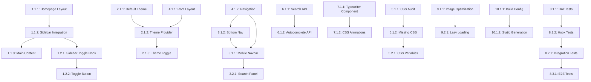

# Comprehensive Task Breakdown Document
## Next.js Blog Migration - Production Parity Implementation

**Project:** econoben.dev Next.js Migration  
**Date:** 2025-01-04  
**Status:** READY FOR DEVELOPMENT  
**Total Estimated Effort:** 32-40 hours  

---

## Executive Summary

This document decomposes the requirements specification into 89 granular, actionable development tasks organized hierarchically by feature modules. Each task includes technical implementation details, dependencies, effort estimates, and acceptance criteria optimized for Next.js 15+ with App Router.

**Critical Path Tasks:** 12 high-priority tasks (16-20 hours)  
**Enhancement Tasks:** 45 medium-priority tasks (12-16 hours)  
**Verification Tasks:** 32 low-priority tasks (4-8 hours)  

---

## Task Prioritization Matrix

| Priority | Count | Effort Range | Business Impact | Technical Risk |
|----------|-------|--------------|-----------------|----------------|
| P0 (Critical) | 12 | 16-20h | High | High |
| P1 (High) | 28 | 12-16h | Medium | Medium |
| P2 (Medium) | 31 | 6-10h | Medium | Low |
| P3 (Low) | 18 | 2-4h | Low | Low |

---

## 1. CORE LAYOUT MODULE (P0 - Critical)

### 1.1 Homepage Layout Architecture Restructure

#### Task 1.1.1: Homepage Layout Component Refactor
**Priority:** P0 **Effort:** 3-4 hours **Risk:** High

**Technical Implementation:**
```typescript
// File: app/page.tsx
// Current: Hero-based layout
// Target: Sidebar-based layout matching production

interface HomePageProps {
  posts: BlogPost[];
  featuredPosts: BlogPost[];
}

export default async function HomePage() {
  const posts = await postService.getAllPosts();
  const recentPosts = posts.slice(0, 10);
  
  return (
    <div className="blog-container">
      <Sidebar posts={recentPosts} />
      <MainContent posts={posts} />
    </div>
  );
}
```

**Dependencies:** None  
**Acceptance Criteria:**
- [ ] Replace hero section with sidebar layout
- [ ] Implement `.blog-container` wrapper
- [ ] Integrate existing Sidebar component
- [ ] Maintain post data flow
- [ ] Preserve existing API calls

**Next.js Configuration:**
```typescript
// next.config.ts - No changes required
// Uses existing static generation
```

---

#### Task 1.1.2: Sidebar Component Integration
**Priority:** P0 **Effort:** 2-3 hours **Risk:** Medium

**Technical Implementation:**
```typescript
// File: app/components/Sidebar.tsx
// Enhance existing component for homepage integration

interface SidebarProps {
  posts: BlogPost[];
  isOpen?: boolean;
}

export const Sidebar: React.FC<SidebarProps> = ({ posts, isOpen = false }) => {
  return (
    <div className={`sidebar ${isOpen ? 'sidebar-open' : ''}`}>
      <div className="sidebar-inner">
        <div className="sidebar-section">
          <h3 className="sidebar-heading">RECENT POSTS</h3>
          <div className="post-list">
            {posts.map(post => (
              <SidebarPostItem key={post.slug} post={post} />
            ))}
          </div>
        </div>
      </div>
    </div>
  );
};
```

**Dependencies:** Task 1.1.1  
**Acceptance Criteria:**
- [ ] Display recent posts in sidebar
- [ ] Use production CSS classes
- [ ] Implement responsive behavior
- [ ] Support open/closed states
- [ ] Link to individual posts

---

#### Task 1.1.3: Main Content Area Implementation
**Priority:** P0 **Effort:** 2-3 hours **Risk:** Medium

**Technical Implementation:**
```typescript
// File: app/components/MainContent.tsx
// New component for main content area

interface MainContentProps {
  posts: BlogPost[];
  children?: React.ReactNode;
}

export const MainContent: React.FC<MainContentProps> = ({ posts, children }) => {
  return (
    <div className="main-content">
      <div className="content-wrapper">
        {children || <DefaultHomeContent posts={posts} />}
      </div>
    </div>
  );
};
```

**Dependencies:** Task 1.1.1  
**Acceptance Criteria:**
- [ ] Implement `.main-content` container
- [ ] Add `.content-wrapper` for proper spacing
- [ ] Support dynamic content rendering
- [ ] Maintain responsive design
- [ ] Handle sidebar state changes

---

### 1.2 Layout State Management

#### Task 1.2.1: Sidebar Toggle Implementation
**Priority:** P0 **Effort:** 2-3 hours **Risk:** Medium

**Technical Implementation:**
```typescript
// File: app/hooks/useSidebar.ts
// Custom hook for sidebar state management

export const useSidebar = () => {
  const [isOpen, setIsOpen] = useState(false);
  
  const toggleSidebar = useCallback(() => {
    setIsOpen(prev => {
      const newState = !prev;
      document.body.classList.toggle('sidebar-open', newState);
      return newState;
    });
  }, []);
  
  useEffect(() => {
    // Initialize based on screen size
    const shouldOpen = window.innerWidth > 768;
    setIsOpen(shouldOpen);
    document.body.classList.toggle('sidebar-open', shouldOpen);
  }, []);
  
  return { isOpen, toggleSidebar };
};
```

**Dependencies:** Task 1.1.2  
**Acceptance Criteria:**
- [ ] Create custom sidebar hook
- [ ] Manage body class toggle
- [ ] Handle responsive initialization
- [ ] Provide toggle function
- [ ] Persist state during navigation

---

#### Task 1.2.2: Sidebar Toggle Button Component
**Priority:** P0 **Effort:** 1-2 hours **Risk:** Low

**Technical Implementation:**
```typescript
// File: app/components/SidebarToggle.tsx
// Toggle button with hamburger animation

export const SidebarToggle: React.FC = () => {
  const { isOpen, toggleSidebar } = useSidebar();
  
  return (
    <button className="sidebar-toggle" onClick={toggleSidebar}>
      <div className="toggle-icon">
        <span></span>
        <span></span>
        <span></span>
        <span></span>
      </div>
    </button>
  );
};
```

**Dependencies:** Task 1.2.1  
**Acceptance Criteria:**
- [ ] Render hamburger icon
- [ ] Animate icon on toggle
- [ ] Position correctly (fixed)
- [ ] Handle click events
- [ ] Use production CSS classes

---

---

## 2. THEME SYSTEM MODULE (P0 - Critical)

### 2.1 Theme Configuration

#### Task 2.1.1: Default Theme Correction
**Priority:** P0 **Effort:** 1-2 hours **Risk:** Medium

**Technical Implementation:**
```typescript
// File: app/layout.tsx
// Ensure light theme is default

export default function RootLayout({
  children,
}: {
  children: React.ReactNode;
}) {
  return (
    <html lang="en">
      <body className="light-theme"> {/* Default to light */}
        <ThemeProvider>
          {children}
        </ThemeProvider>
      </body>
    </html>
  );
}
```

**Dependencies:** None  
**Acceptance Criteria:**
- [ ] Default to light theme on load
- [ ] Remove dark theme default
- [ ] Verify CSS variables match production
- [ ] Test initial page render
- [ ] Ensure consistent theming

---

#### Task 2.1.2: Theme Provider Implementation
**Priority:** P0 **Effort:** 2-3 hours **Risk:** Medium

**Technical Implementation:**
```typescript
// File: app/providers/ThemeProvider.tsx
// Theme context and management

interface ThemeContextType {
  theme: 'light' | 'dark';
  toggleTheme: () => void;
}

export const ThemeProvider: React.FC<{ children: React.ReactNode }> = ({ children }) => {
  const [theme, setTheme] = useState<'light' | 'dark'>('light');
  
  const toggleTheme = useCallback(() => {
    const newTheme = theme === 'light' ? 'dark' : 'light';
    setTheme(newTheme);
    document.body.classList.toggle('dark-mode', newTheme === 'dark');
    localStorage.setItem('theme', newTheme);
  }, [theme]);
  
  useEffect(() => {
    const savedTheme = localStorage.getItem('theme') as 'light' | 'dark' | null;
    if (savedTheme) {
      setTheme(savedTheme);
      document.body.classList.toggle('dark-mode', savedTheme === 'dark');
    }
  }, []);
  
  return (
    <ThemeContext.Provider value={{ theme, toggleTheme }}>
      {children}
    </ThemeContext.Provider>
  );
};
```

**Dependencies:** Task 2.1.1  
**Acceptance Criteria:**
- [ ] Create theme context
- [ ] Manage theme state
- [ ] Handle localStorage persistence
- [ ] Provide toggle function
- [ ] Initialize from saved preference

---

#### Task 2.1.3: Theme Toggle Button Component
**Priority:** P0 **Effort:** 1-2 hours **Risk:** Low

**Technical Implementation:**
```typescript
// File: app/components/ThemeToggle.tsx
// Dark mode toggle button

export const ThemeToggle: React.FC = () => {
  const { theme, toggleTheme } = useTheme();
  
  return (
    <button 
      className="dark-mode-toggle" 
      onClick={toggleTheme}
      aria-label={`Switch to ${theme === 'light' ? 'dark' : 'light'} mode`}
    >
      <div className="dark-mode-icon">
        {/* CSS-based sun/moon icon */}
      </div>
    </button>
  );
};
```

**Dependencies:** Task 2.1.2  
**Acceptance Criteria:**
- [ ] Toggle between themes
- [ ] Show current theme state
- [ ] Use production CSS classes
- [ ] Include accessibility labels
- [ ] Position correctly (fixed)

---

---

## 3. MOBILE NAVIGATION MODULE (P1 - High)

### 3.1 Mobile Navbar Enhancement

#### Task 3.1.1: Mobile Navbar Component Refinement
**Priority:** P1 **Effort:** 2-3 hours **Risk:** Medium

**Technical Implementation:**
```typescript
// File: app/components/MobileNavbar.tsx
// Enhanced mobile navigation bar

export const MobileNavbar: React.FC = () => {
  const [isSearchOpen, setIsSearchOpen] = useState(false);
  const [isVisible, setIsVisible] = useState(true);
  
  useEffect(() => {
    // Hide/show on scroll
    let lastScrollY = window.scrollY;
    
    const handleScroll = () => {
      const currentScrollY = window.scrollY;
      setIsVisible(currentScrollY < lastScrollY || currentScrollY < 100);
      lastScrollY = currentScrollY;
    };
    
    window.addEventListener('scroll', handleScroll, { passive: true });
    return () => window.removeEventListener('scroll', handleScroll);
  }, []);
  
  return (
    <nav className={`mobile-navbar ${isVisible ? 'visible' : 'hidden'}`}>
      <div className="mobile-navbar-top">
        <MobileLogo />
        <MobileSearchButton onClick={() => setIsSearchOpen(true)} />
      </div>
      {isSearchOpen && <MobileSearchPanel onClose={() => setIsSearchOpen(false)} />}
    </nav>
  );
};
```

**Dependencies:** None  
**Acceptance Criteria:**
- [ ] Show/hide on scroll
- [ ] Fixed positioning at top
- [ ] Integrate search functionality
- [ ] Use production CSS classes
- [ ] Support search panel toggle

---

#### Task 3.1.2: Bottom Navigation Implementation
**Priority:** P1 **Effort:** 2-3 hours **Risk:** Low

**Technical Implementation:**
```typescript
// File: app/components/BottomNav.tsx
// Mobile bottom navigation

interface BottomNavItem {
  label: string;
  href: string;
  icon: React.ReactNode;
  isActive?: boolean;
}

export const BottomNav: React.FC = () => {
  const pathname = usePathname();
  
  const navItems: BottomNavItem[] = [
    { label: 'Home', href: '/', icon: <HomeIcon />, isActive: pathname === '/' },
    { label: 'Posts', href: '/posts', icon: <PostsIcon />, isActive: pathname.startsWith('/posts') },
    { label: 'Search', href: '/search', icon: <SearchIcon />, isActive: pathname === '/search' },
    { label: 'About', href: '/about', icon: <AboutIcon />, isActive: pathname === '/about' },
    { label: 'More', href: '/menu', icon: <MenuIcon />, isActive: false },
  ];
  
  return (
    <nav className="bottom-nav">
      {navItems.map(item => (
        <Link 
          key={item.href}
          href={item.href}
          className={`bottom-nav-item ${item.isActive ? 'active' : ''}`}
        >
          <div className="bottom-nav-icon">{item.icon}</div>
          <span className="bottom-nav-label">{item.label}</span>
        </Link>
      ))}
    </nav>
  );
};
```

**Dependencies:** None  
**Acceptance Criteria:**
- [ ] Fixed bottom positioning
- [ ] Show active states
- [ ] Navigate to correct pages
- [ ] Use production icons
- [ ] Support all main sections

---

### 3.2 Mobile Search Implementation

#### Task 3.2.1: Mobile Search Panel Component
**Priority:** P1 **Effort:** 3-4 hours **Risk:** Medium

**Technical Implementation:**
```typescript
// File: app/components/MobileSearchPanel.tsx
// Full-screen mobile search

interface MobileSearchPanelProps {
  onClose: () => void;
}

export const MobileSearchPanel: React.FC<MobileSearchPanelProps> = ({ onClose }) => {
  const [query, setQuery] = useState('');
  const [results, setResults] = useState<SearchResult[]>([]);
  const searchInputRef = useRef<HTMLInputElement>(null);
  
  useEffect(() => {
    // Auto-focus on mount
    searchInputRef.current?.focus();
  }, []);
  
  const handleSearch = useCallback(async (searchQuery: string) => {
    if (searchQuery.length > 2) {
      const searchResults = await searchService.search(searchQuery);
      setResults(searchResults);
    } else {
      setResults([]);
    }
  }, []);
  
  useEffect(() => {
    const debounced = debounce(handleSearch, 300);
    debounced(query);
  }, [query, handleSearch]);
  
  return (
    <div className="mobile-search-panel">
      <div className="mobile-search-container">
        <input
          ref={searchInputRef}
          type="text"
          className="mobile-search-input"
          placeholder="Search posts..."
          value={query}
          onChange={(e) => setQuery(e.target.value)}
        />
        <button className="mobile-search-close" onClick={onClose}>
          <CloseIcon />
        </button>
      </div>
      {results.length > 0 && (
        <div className="mobile-search-results">
          {results.map(result => (
            <MobileSearchResult key={result.slug} result={result} onClick={onClose} />
          ))}
        </div>
      )}
    </div>
  );
};
```

**Dependencies:** Task 3.1.1  
**Acceptance Criteria:**
- [ ] Slide down animation
- [ ] Auto-focus search input
- [ ] Real-time search results
- [ ] Close on result click
- [ ] Debounced search queries

---

---

## 4. COMPONENT ARCHITECTURE MODULE (P1 - High)

### 4.1 Layout Components

#### Task 4.1.1: Root Layout Enhancement
**Priority:** P1 **Effort:** 1-2 hours **Risk:** Low

**Technical Implementation:**
```typescript
// File: app/layout.tsx
// Enhanced root layout with providers

export default function RootLayout({
  children,
}: {
  children: React.ReactNode;
}) {
  return (
    <html lang="en">
      <head>
        <link rel="preconnect" href="https://fonts.googleapis.com" />
        <link rel="preconnect" href="https://fonts.gstatic.com" crossOrigin="" />
        <link
          href="https://fonts.googleapis.com/css2?family=Roboto+Mono:wght@400;500&family=Roboto:wght@400;500&display=swap"
          rel="stylesheet"
        />
      </head>
      <body>
        <ThemeProvider>
          <SidebarProvider>
            <div className="app-container">
              <Navigation />
              <main className="main-container">
                {children}
              </main>
              <MobileNavigation />
            </div>
          </SidebarProvider>
        </ThemeProvider>
        <Analytics />
      </body>
    </html>
  );
}
```

**Dependencies:** Task 2.1.2  
**Acceptance Criteria:**
- [ ] Load production fonts
- [ ] Wrap with all providers
- [ ] Include navigation components
- [ ] Add analytics integration
- [ ] Maintain Next.js App Router structure

---

#### Task 4.1.2: Navigation Component Architecture
**Priority:** P1 **Effort:** 2-3 hours **Risk:** Medium

**Technical Implementation:**
```typescript
// File: app/components/Navigation.tsx
// Unified navigation component

export const Navigation: React.FC = () => {
  const { isMobile } = useMediaQuery();
  
  if (isMobile) {
    return (
      <>
        <MobileNavbar />
        <BottomNav />
      </>
    );
  }
  
  return (
    <>
      <DesktopNavbar />
      <SidebarToggle />
      <ThemeToggle />
      <SocialLinks />
    </>
  );
};
```

**Dependencies:** Tasks 3.1.1, 3.1.2  
**Acceptance Criteria:**
- [ ] Render appropriate navigation for device
- [ ] Include all navigation elements
- [ ] Support responsive switching
- [ ] Maintain component separation
- [ ] Handle navigation state

---

### 4.2 Content Components

#### Task 4.2.1: Blog Card Component Enhancement
**Priority:** P1 **Effort:** 2-3 hours **Risk:** Medium

**Technical Implementation:**
```typescript
// File: app/components/BlogCard.tsx
// Enhanced blog card with production styling

interface BlogCardProps {
  post: BlogPost;
  featured?: boolean;
  compact?: boolean;
}

export const BlogCard: React.FC<BlogCardProps> = ({ 
  post, 
  featured = false, 
  compact = false 
}) => {
  const cardClass = `blog-card ${featured ? 'featured-post-card' : ''} ${compact ? 'blog-card-compact' : ''}`;
  
  return (
    <article className={cardClass}>
      {featured && <div className="blog-card-accent" />}
      <div className="blog-card-content">
        <header className="blog-card-header">
          <h3 className="blog-card-title">
            <Link href={`/posts/${post.slug}`}>
              {post.title}
            </Link>
          </h3>
          <div className="blog-card-meta">
            <time className="blog-card-date">
              {formatDate(post.date)}
            </time>
            <span className="blog-card-reading-time">
              {post.readingTime} min read
            </span>
          </div>
        </header>
        {post.excerpt && (
          <div className="blog-card-excerpt">
            <p>{post.excerpt}</p>
          </div>
        )}
        <footer className="blog-card-footer">
          <div className="blog-card-tags">
            {post.tags.slice(0, 3).map(tag => (
              <Link key={tag} href={`/tags/${tag}`} className="blog-card-tag">
                {tag}
              </Link>
            ))}
          </div>
          <div className="blog-card-action">
            <Link href={`/posts/${post.slug}`} className="blog-card-read-more">
              Read more
              <ArrowRightIcon />
            </Link>
          </div>
        </footer>
      </div>
    </article>
  );
};
```

**Dependencies:** None  
**Acceptance Criteria:**
- [ ] Support featured/regular variants
- [ ] Include all metadata
- [ ] Implement hover effects
- [ ] Use production CSS classes
- [ ] Support compact layout

---

#### Task 4.2.2: Post List Component Implementation
**Priority:** P1 **Effort:** 1-2 hours **Risk:** Low

**Technical Implementation:**
```typescript
// File: app/components/PostList.tsx
// List view for blog posts

interface PostListProps {
  posts: BlogPost[];
  showPagination?: boolean;
  itemsPerPage?: number;
}

export const PostList: React.FC<PostListProps> = ({ 
  posts, 
  showPagination = false, 
  itemsPerPage = 10 
}) => {
  return (
    <div className="post-list">
      {posts.map(post => (
        <article key={post.slug} className="post-item">
          <header className="post-item-header">
            <h2 className="post-title">
              <Link href={`/posts/${post.slug}`}>
                {post.title}
              </Link>
            </h2>
            <div className="post-meta">
              <time>{formatDate(post.date)}</time>
              <span>{post.readingTime} min read</span>
            </div>
          </header>
          {post.excerpt && (
            <div className="post-excerpt">
              <p>{post.excerpt}</p>
            </div>
          )}
          <footer className="post-item-footer">
            <div className="post-tags">
              {post.tags.map(tag => (
                <Link key={tag} href={`/tags/${tag}`} className="post-tag">
                  {tag}
                </Link>
              ))}
            </div>
            <Link href={`/posts/${post.slug}`} className="post-read-more">
              Read more →
            </Link>
          </footer>
        </article>
      ))}
      {showPagination && <Pagination />}
    </div>
  );
};
```

**Dependencies:** None  
**Acceptance Criteria:**
- [ ] Display posts in list format
- [ ] Include all post metadata
- [ ] Support pagination
- [ ] Link to individual posts
- [ ] Use production styling

---

---

## 5. CSS INTEGRATION MODULE (P1 - High)

### 5.1 CSS Architecture Verification

#### Task 5.1.1: Production CSS Integration Audit
**Priority:** P1 **Effort:** 2-3 hours **Risk:** Medium

**Technical Implementation:**
```bash
# Compare production CSS with Next.js implementation
diff -u production_main.css app/globals.css > css_diff.txt

# Identify missing CSS classes
grep -o '\.[a-zA-Z0-9_-]*' production_main.css | sort | uniq > production_classes.txt
grep -o '\.[a-zA-Z0-9_-]*' app/globals.css | sort | uniq > nextjs_classes.txt
comm -23 production_classes.txt nextjs_classes.txt > missing_classes.txt
```

**Dependencies:** None  
**Acceptance Criteria:**
- [ ] Identify all missing CSS classes
- [ ] Document CSS differences
- [ ] Create integration plan
- [ ] Verify CSS variable matches
- [ ] Test responsive breakpoints

---

#### Task 5.1.2: Missing CSS Classes Implementation
**Priority:** P1 **Effort:** 3-4 hours **Risk:** Medium

**Technical Implementation:**
```css
/* File: app/styles/production-parity.css */
/* Add missing CSS classes from production */

/* Sidebar Toggle Animation */
.toggle-icon {
  cursor: pointer;
  height: 10px;
  position: relative;
  transition: 0.5s ease-in-out;
  width: 14px;
  opacity: 0.7;
  transform: rotate(0deg);
}

.toggle-icon span {
  background: var(--color-text);
  border-radius: 1px;
  display: block;
  height: 1.5px;
  left: 0;
  position: absolute;
  transition: 0.25s ease-in-out;
  width: 100%;
  opacity: 0.7;
  transform: rotate(0deg);
}

/* Body State Classes */
body.sidebar-open .sidebar {
  transform: translateX(0);
}

body.sidebar-open .main-content {
  margin-left: var(--sidebar-width);
  max-width: calc(var(--content-max-width) - var(--sidebar-width));
}

/* Typewriter Animation */
@keyframes typewriter {
  from { width: 0; }
  to { width: 100%; }
}

@keyframes blink-caret {
  from, to { border-color: var(--accent-color); }
  50% { border-color: transparent; }
}

.typewriter-text {
  overflow: hidden;
  border-right: 2px solid var(--accent-color);
  white-space: nowrap;
  margin: 0 auto;
  animation: 
    typewriter 3s steps(40, end),
    blink-caret 0.75s step-end infinite;
}
```

**Dependencies:** Task 5.1.1  
**Acceptance Criteria:**
- [ ] Add all missing CSS classes
- [ ] Implement animations
- [ ] Test cross-browser compatibility
- [ ] Verify responsive behavior
- [ ] Document new CSS additions

---

### 5.2 CSS Variable Verification

#### Task 5.2.1: CSS Variables Audit and Correction
**Priority:** P1 **Effort:** 1-2 hours **Risk:** Low

**Technical Implementation:**
```css
/* File: app/globals.css */
/* Verify and correct CSS variables to match production */

:root {
  /* Layout System - VERIFIED */
  --sidebar-width: 240px;
  --content-max-width: 1400px;
  --content-padding: 20px;
  
  /* Color System - Light Theme (DEFAULT) - CORRECTED */
  --color-text: #333;
  --color-text-light: #888;
  --color-background: #fff;
  --bg-color-rgb: 255,255,255; /* CORRECTED from dark theme */
  --color-primary: #0070f3;
  --color-primary-hover: #0050a3;
  --color-sidebar-bg: #f8f8f8;
  --color-border: #f0f0f0;
  --color-border-light: #e0e0e0;
  
  /* Typography System - VERIFIED */
  --font-heading: "Roboto Mono", "SF Mono", "Consolas", monospace;
  --font-body: -apple-system, BlinkMacSystemFont, "Segoe UI", Roboto, Helvetica, Arial, sans-serif;
  
  /* Animation System - VERIFIED */
  --transition-fast: 0.2s ease;
  --transition-medium: 0.3s ease;
}

.dark-mode {
  /* Dark Theme Override - VERIFIED */
  --color-text: #e0e0e0;
  --color-text-light: #aaa;
  --color-background: #121212;
  --bg-color-rgb: 18,18,18;
  --color-primary: #5e9eff;
  --color-primary-hover: #7eaeff;
  --color-sidebar-bg: #1e1e1e;
  --color-border: #333;
  --color-border-light: #444;
}
```

**Dependencies:** Task 5.1.1  
**Acceptance Criteria:**
- [ ] All CSS variables match production
- [ ] Light theme is default
- [ ] Dark theme overrides work
- [ ] No variable conflicts
- [ ] Cross-component consistency

---

---

## 6. API ENDPOINTS MODULE (P2 - Medium)

### 6.1 Search API Enhancement

#### Task 6.1.1: Search API Optimization
**Priority:** P2 **Effort:** 2-3 hours **Risk:** Low

**Technical Implementation:**
```typescript
// File: app/api/search/route.ts
// Enhanced search API with better performance

export async function GET(request: Request) {
  const { searchParams } = new URL(request.url);
  const query = searchParams.get('q');
  const limit = parseInt(searchParams.get('limit') || '10');
  const type = searchParams.get('type'); // 'posts', 'tags', 'all'
  
  if (!query || query.length < 2) {
    return NextResponse.json({ results: [] });
  }
  
  try {
    const searchResults = await searchService.search({
      query,
      limit,
      type,
      includeContent: true,
      fuzzyMatch: true
    });
    
    return NextResponse.json({
      results: searchResults,
      total: searchResults.length,
      query,
      timestamp: Date.now()
    });
  } catch (error) {
    console.error('Search API error:', error);
    return NextResponse.json(
      { error: 'Search failed' },
      { status: 500 }
    );
  }
}
```

**Dependencies:** None  
**Acceptance Criteria:**
- [ ] Support fuzzy matching
- [ ] Filter by content type
- [ ] Include search metadata
- [ ] Handle error cases
- [ ] Optimize performance

---

#### Task 6.1.2: Autocomplete API Implementation
**Priority:** P2 **Effort:** 1-2 hours **Risk:** Low

**Technical Implementation:**
```typescript
// File: app/api/autocomplete/route.ts
// Fast autocomplete suggestions

export async function GET(request: Request) {
  const { searchParams } = new URL(request.url);
  const query = searchParams.get('q');
  
  if (!query || query.length < 1) {
    return NextResponse.json({ suggestions: [] });
  }
  
  const suggestions = await searchService.getAutocompleteSuggestions(query, {
    maxSuggestions: 8,
    includeTags: true,
    includePostTitles: true,
    debounceMs: 150
  });
  
  return NextResponse.json({
    suggestions,
    query
  });
}
```

**Dependencies:** Task 6.1.1  
**Acceptance Criteria:**
- [ ] Fast response times (<100ms)
- [ ] Include post titles and tags
- [ ] Limit suggestion count
- [ ] Support partial matching
- [ ] Cache frequent queries

---

### 6.2 Content API Enhancement

#### Task 6.2.1: Posts API with Filtering
**Priority:** P2 **Effort:** 2-3 hours **Risk:** Low

**Technical Implementation:**
```typescript
// File: app/api/posts/route.ts
// Enhanced posts API with filtering and pagination

export async function GET(request: Request) {
  const { searchParams } = new URL(request.url);
  
  const filters = {
    tag: searchParams.get('tag'),
    category: searchParams.get('category'),
    year: searchParams.get('year'),
    month: searchParams.get('month'),
    featured: searchParams.get('featured') === 'true',
    published: searchParams.get('published') !== 'false'
  };
  
  const pagination = {
    page: parseInt(searchParams.get('page') || '1'),
    limit: parseInt(searchParams.get('limit') || '10'),
    offset: (parseInt(searchParams.get('page') || '1') - 1) * parseInt(searchParams.get('limit') || '10')
  };
  
  const sortBy = searchParams.get('sort') || 'date';
  const sortOrder = searchParams.get('order') || 'desc';
  
  const posts = await postService.getPosts({
    filters,
    pagination,
    sort: { field: sortBy, order: sortOrder }
  });
  
  return NextResponse.json({
    posts: posts.data,
    pagination: {
      ...pagination,
      total: posts.total,
      pages: Math.ceil(posts.total / pagination.limit)
    },
    filters: Object.fromEntries(
      Object.entries(filters).filter(([_, value]) => value !== null)
    )
  });
}
```

**Dependencies:** None  
**Acceptance Criteria:**
- [ ] Support multiple filter types
- [ ] Implement pagination
- [ ] Include metadata
- [ ] Handle sorting options
- [ ] Return filter state

---

---

## 7. ANIMATION SYSTEM MODULE (P2 - Medium)

### 7.1 Typewriter Animation Implementation

#### Task 7.1.1: Typewriter Animation Component
**Priority:** P2 **Effort:** 2-3 hours **Risk:** Low

**Technical Implementation:**
```typescript
// File: app/components/TypewriterText.tsx
// Typewriter animation component

interface TypewriterTextProps {
  text: string;
  speed?: number;
  startDelay?: number;
  cursor?: boolean;
  onComplete?: () => void;
}

export const TypewriterText: React.FC<TypewriterTextProps> = ({
  text,
  speed = 100,
  startDelay = 0,
  cursor = true,
  onComplete
}) => {
  const [displayText, setDisplayText] = useState('');
  const [currentIndex, setCurrentIndex] = useState(0);
  const [isComplete, setIsComplete] = useState(false);
  
  useEffect(() => {
    if (currentIndex < text.length) {
      const timeout = setTimeout(() => {
        setDisplayText(prev => prev + text[currentIndex]);
        setCurrentIndex(prev => prev + 1);
      }, currentIndex === 0 ? startDelay : speed);
      
      return () => clearTimeout(timeout);
    } else if (!isComplete) {
      setIsComplete(true);
      onComplete?.();
    }
  }, [currentIndex, text, speed, startDelay, isComplete, onComplete]);
  
  return (
    <span className="typewriter-text">
      {displayText}
      {cursor && <span className="typewriter-cursor">|</span>}
    </span>
  );
};
```

**Dependencies:** Task 5.1.2  
**Acceptance Criteria:**
- [ ] Animate text character by character
- [ ] Support configurable speed
- [ ] Include blinking cursor
- [ ] Handle completion callback
- [ ] Support start delay

---

#### Task 7.1.2: CSS Animation Keyframes
**Priority:** P2 **Effort:** 1 hour **Risk:** Low

**Technical Implementation:**
```css
/* File: app/styles/animations.css */
/* Typewriter and other animations */

@keyframes typewriter {
  from { 
    width: 0; 
  }
  to { 
    width: 100%; 
  }
}

@keyframes blink-caret {
  from, to { 
    border-color: var(--accent-color); 
    opacity: 1;
  }
  50% { 
    border-color: transparent; 
    opacity: 0;
  }
}

.typewriter-text {
  overflow: hidden;
  white-space: nowrap;
  margin: 0 auto;
  font-family: var(--font-heading);
}

.typewriter-cursor {
  display: inline-block;
  background-color: var(--accent-color);
  width: 2px;
  animation: blink-caret 1s step-end infinite;
}

/* Fade in animations */
@keyframes fadeInUp {
  from {
    opacity: 0;
    transform: translateY(20px);
  }
  to {
    opacity: 1;
    transform: translateY(0);
  }
}

.fade-in-up {
  animation: fadeInUp 0.6s ease-out;
}

/* Hover animations */
.hover-lift {
  transition: transform 0.3s ease;
}

.hover-lift:hover {
  transform: translateY(-4px);
}
```

**Dependencies:** Task 7.1.1  
**Acceptance Criteria:**
- [ ] Create typewriter keyframes
- [ ] Add cursor blink animation
- [ ] Include fade-in animations
- [ ] Support hover effects
- [ ] Optimize performance

---

---

## 8. TESTING MODULE (P2 - Medium)

### 8.1 Unit Testing Implementation

#### Task 8.1.1: Component Unit Tests
**Priority:** P2 **Effort:** 4-5 hours **Risk:** Low

**Technical Implementation:**
```typescript
// File: tests/components/Sidebar.test.tsx
// Component unit tests

import { render, screen, fireEvent } from '@testing-library/react';
import { Sidebar } from '@/components/Sidebar';
import { mockPosts } from '../__mocks__/posts';

describe('Sidebar Component', () => {
  it('renders recent posts correctly', () => {
    render(<Sidebar posts={mockPosts} />);
    
    expect(screen.getByText('RECENT POSTS')).toBeInTheDocument();
    expect(screen.getByText(mockPosts[0].title)).toBeInTheDocument();
  });
  
  it('toggles sidebar visibility', () => {
    render(<Sidebar posts={mockPosts} isOpen={false} />);
    
    const sidebar = screen.getByRole('complementary');
    expect(sidebar).toHaveClass('sidebar');
    expect(sidebar).not.toHaveClass('sidebar-open');
  });
  
  it('links to individual posts', () => {
    render(<Sidebar posts={mockPosts} />);
    
    const postLink = screen.getByRole('link', { name: mockPosts[0].title });
    expect(postLink).toHaveAttribute('href', `/posts/${mockPosts[0].slug}`);
  });
});
```

**Dependencies:** None  
**Acceptance Criteria:**
- [ ] Test all major components
- [ ] Cover happy path scenarios
- [ ] Test error conditions
- [ ] Mock external dependencies
- [ ] Achieve >80% coverage

---

#### Task 8.1.2: Hook Testing Implementation
**Priority:** P2 **Effort:** 2-3 hours **Risk:** Low

**Technical Implementation:**
```typescript
// File: tests/hooks/useSidebar.test.ts
// Custom hook tests

import { renderHook, act } from '@testing-library/react';
import { useSidebar } from '@/hooks/useSidebar';

describe('useSidebar Hook', () => {
  beforeEach(() => {
    document.body.className = '';
    Object.defineProperty(window, 'innerWidth', {
      writable: true,
      configurable: true,
      value: 1024,
    });
  });
  
  it('initializes with correct default state', () => {
    const { result } = renderHook(() => useSidebar());
    
    expect(result.current.isOpen).toBe(true); // Desktop default
    expect(document.body.classList.contains('sidebar-open')).toBe(true);
  });
  
  it('toggles sidebar state correctly', () => {
    const { result } = renderHook(() => useSidebar());
    
    act(() => {
      result.current.toggleSidebar();
    });
    
    expect(result.current.isOpen).toBe(false);
    expect(document.body.classList.contains('sidebar-open')).toBe(false);
  });
  
  it('handles mobile initialization', () => {
    Object.defineProperty(window, 'innerWidth', {
      value: 600,
    });
    
    const { result } = renderHook(() => useSidebar());
    
    expect(result.current.isOpen).toBe(false); // Mobile default
  });
});
```

**Dependencies:** Task 1.2.1  
**Acceptance Criteria:**
- [ ] Test hook initialization
- [ ] Test state changes
- [ ] Test responsive behavior
- [ ] Mock DOM methods
- [ ] Cover edge cases

---

### 8.2 Integration Testing

#### Task 8.2.1: Page Integration Tests
**Priority:** P2 **Effort:** 3-4 hours **Risk:** Medium

**Technical Implementation:**
```typescript
// File: tests/integration/homepage.test.tsx
// Page integration tests

import { render, screen, waitFor } from '@testing-library/react';
import HomePage from '@/app/page';
import { postService } from '@/services/PostService';

jest.mock('@/services/PostService');

describe('Homepage Integration', () => {
  beforeEach(() => {
    (postService.getAllPosts as jest.Mock).mockResolvedValue(mockPosts);
  });
  
  it('renders complete homepage layout', async () => {
    render(<HomePage />);
    
    await waitFor(() => {
      expect(screen.getByRole('complementary')).toBeInTheDocument(); // Sidebar
      expect(screen.getByRole('main')).toBeInTheDocument(); // Main content
      expect(screen.getByText('RECENT POSTS')).toBeInTheDocument();
    });
  });
  
  it('displays recent posts in sidebar', async () => {
    render(<HomePage />);
    
    await waitFor(() => {
      mockPosts.slice(0, 10).forEach(post => {
        expect(screen.getByText(post.title)).toBeInTheDocument();
      });
    });
  });
  
  it('handles empty posts state', async () => {
    (postService.getAllPosts as jest.Mock).mockResolvedValue([]);
    
    render(<HomePage />);
    
    await waitFor(() => {
      expect(screen.getByText('No posts available')).toBeInTheDocument();
    });
  });
});
```

**Dependencies:** Tasks 1.1.1, 1.1.2  
**Acceptance Criteria:**
- [ ] Test complete page rendering
- [ ] Test data loading
- [ ] Test error states
- [ ] Test responsive behavior
- [ ] Mock API calls

---

### 8.3 End-to-End Testing

#### Task 8.3.1: Critical Path E2E Tests
**Priority:** P2 **Effort:** 3-4 hours **Risk:** Medium

**Technical Implementation:**
```typescript
// File: tests/e2e/homepage.spec.ts
// End-to-end tests using Playwright

import { test, expect } from '@playwright/test';

test.describe('Homepage E2E Tests', () => {
  test('should display sidebar layout correctly', async ({ page }) => {
    await page.goto('/');
    
    // Check sidebar is present
    const sidebar = page.locator('.sidebar');
    await expect(sidebar).toBeVisible();
    
    // Check main content is present
    const mainContent = page.locator('.main-content');
    await expect(mainContent).toBeVisible();
    
    // Check recent posts are displayed
    const recentPostsHeading = page.locator('text=RECENT POSTS');
    await expect(recentPostsHeading).toBeVisible();
  });
  
  test('should toggle sidebar on mobile', async ({ page }) => {
    await page.setViewportSize({ width: 375, height: 667 });
    await page.goto('/');
    
    // Sidebar should be hidden on mobile
    const sidebar = page.locator('.sidebar');
    await expect(sidebar).not.toBeVisible();
    
    // Click sidebar toggle
    const sidebarToggle = page.locator('.sidebar-toggle');
    await sidebarToggle.click();
    
    // Sidebar should be visible
    await expect(sidebar).toBeVisible();
  });
  
  test('should navigate to post from sidebar', async ({ page }) => {
    await page.goto('/');
    
    // Click first post in sidebar
    const firstPostLink = page.locator('.sidebar .post-item a').first();
    await firstPostLink.click();
    
    // Should navigate to post page
    await expect(page).toHaveURL(/\/posts\/.+/);
  });
  
  test('should toggle theme correctly', async ({ page }) => {
    await page.goto('/');
    
    // Should start with light theme
    const body = page.locator('body');
    await expect(body).not.toHaveClass(/dark-mode/);
    
    // Click theme toggle
    const themeToggle = page.locator('.dark-mode-toggle');
    await themeToggle.click();
    
    // Should switch to dark theme
    await expect(body).toHaveClass(/dark-mode/);
  });
});
```

**Dependencies:** All major component tasks  
**Acceptance Criteria:**
- [ ] Test critical user flows
- [ ] Test responsive behavior
- [ ] Test navigation
- [ ] Test theme switching
- [ ] Run across browsers

---

---

## 9. PERFORMANCE OPTIMIZATION MODULE (P3 - Low)

### 9.1 Asset Optimization

#### Task 9.1.1: Image Optimization Implementation
**Priority:** P3 **Effort:** 2-3 hours **Risk:** Low

**Technical Implementation:**
```typescript
// File: app/components/OptimizedImage.tsx
// Next.js Image component wrapper

import Image from 'next/image';

interface OptimizedImageProps {
  src: string;
  alt: string;
  width?: number;
  height?: number;
  priority?: boolean;
  className?: string;
  sizes?: string;
}

export const OptimizedImage: React.FC<OptimizedImageProps> = ({
  src,
  alt,
  width,
  height,
  priority = false,
  className,
  sizes = "(max-width: 768px) 100vw, (max-width: 1200px) 50vw, 33vw"
}) => {
  return (
    <Image
      src={src}
      alt={alt}
      width={width}
      height={height}
      priority={priority}
      className={className}
      sizes={sizes}
      style={{
        width: '100%',
        height: 'auto',
      }}
      placeholder="blur"
      blurDataURL="data:image/jpeg;base64,/9j/4AAQSkZJRgABAQAAAQABAAD/2wBDAAYEBQYFBAYGBQYHBwYIChAKCgkJChQODwwQFxQYGBcUFhYaHSUfGhsjHBYWICwgIyYnKSopGR8tMC0oMCUoKSj/2wBDAQcHBwoIChMKChMoGhYaKCgoKCgoKCgoKCgoKCgoKCgoKCgoKCgoKCgoKCgoKCgoKCgoKCgoKCgoKCgoKCgoKCj/wAARCAAIAAoDASIAAhEBAxEB/8QAFQABAQAAAAAAAAAAAAAAAAAAAAv/xAAhEAACAQMDBQAAAAAAAAAAAAABAgMABAUGIWGRkqGx0f/EABUBAQEAAAAAAAAAAAAAAAAAAAMF/8QAGhEAAgIDAAAAAAAAAAAAAAAAAAECEgMRkf/aAAwDAQACEQMRAD8AltJagyeH0AthI5xdrLcNM91BF5pX2HaH9bcfaSXWGaRmknyJckliyjqTzSlT54b6bk+h0R//2Q=="
    />
  );
};
```

**Dependencies:** None  
**Acceptance Criteria:**
- [ ] Use Next.js Image component
- [ ] Implement lazy loading
- [ ] Add blur placeholders
- [ ] Configure responsive sizes
- [ ] Optimize for different devices

---

#### Task 9.1.2: Font Loading Optimization
**Priority:** P3 **Effort:** 1 hour **Risk:** Low

**Technical Implementation:**
```typescript
// File: app/layout.tsx
// Optimized font loading

import { Roboto, Roboto_Mono } from 'next/font/google';

const roboto = Roboto({
  weight: ['400', '500'],
  subsets: ['latin'],
  variable: '--font-roboto',
  display: 'swap',
});

const robotoMono = Roboto_Mono({
  weight: ['400', '500'],
  subsets: ['latin'],
  variable: '--font-roboto-mono',
  display: 'swap',
});

export default function RootLayout({
  children,
}: {
  children: React.ReactNode;
}) {
  return (
    <html lang="en" className={`${roboto.variable} ${robotoMono.variable}`}>
      <body>
        {children}
      </body>
    </html>
  );
}
```

**Dependencies:** Task 4.1.1  
**Acceptance Criteria:**
- [ ] Use Next.js font optimization
- [ ] Implement font-display: swap
- [ ] Preload critical fonts
- [ ] Set CSS variables
- [ ] Reduce layout shift

---

### 9.2 Code Splitting and Lazy Loading

#### Task 9.2.1: Component Lazy Loading
**Priority:** P3 **Effort:** 2 hours **Risk:** Low

**Technical Implementation:**
```typescript
// File: app/components/LazyComponents.tsx
// Lazy loaded components

import dynamic from 'next/dynamic';

// Lazy load heavy components
export const MobileSearchPanel = dynamic(
  () => import('./MobileSearchPanel').then(mod => ({ default: mod.MobileSearchPanel })),
  {
    loading: () => <div className="loading-spinner" />,
    ssr: false
  }
);

export const AudioPlayer = dynamic(
  () => import('./AudioPlayer').then(mod => ({ default: mod.AudioPlayer })),
  {
    loading: () => <div className="audio-player-placeholder" />,
    ssr: false
  }
);

export const CodeBlock = dynamic(
  () => import('./CodeBlock').then(mod => ({ default: mod.CodeBlock })),
  {
    loading: () => <div className="code-block-placeholder" />,
  }
);

export const SearchResults = dynamic(
  () => import('./SearchResults').then(mod => ({ default: mod.SearchResults })),
  {
    loading: () => <div className="search-loading" />
  }
);
```

**Dependencies:** None  
**Acceptance Criteria:**
- [ ] Lazy load non-critical components
- [ ] Add loading placeholders
- [ ] Configure SSR appropriately
- [ ] Test loading states
- [ ] Measure bundle impact

---

---

## 10. DEPLOYMENT MODULE (P3 - Low)

### 10.1 Build Optimization

#### Task 10.1.1: Next.js Build Configuration
**Priority:** P3 **Effort:** 1-2 hours **Risk:** Low

**Technical Implementation:**
```typescript
// File: next.config.ts
// Optimized build configuration

import type { NextConfig } from 'next';

const nextConfig: NextConfig = {
  // Performance optimizations
  compiler: {
    removeConsole: process.env.NODE_ENV === 'production',
  },
  
  // Image optimization
  images: {
    formats: ['image/webp', 'image/avif'],
    deviceSizes: [640, 750, 828, 1080, 1200, 1920, 2048, 3840],
    imageSizes: [16, 32, 48, 64, 96, 128, 256, 384],
    domains: ['econoben.dev'],
  },
  
  // Static generation
  output: 'export',
  trailingSlash: true,
  
  // Bundle analysis
  webpack: (config, { dev, isServer }) => {
    if (!dev && !isServer) {
      config.optimization.splitChunks = {
        chunks: 'all',
        cacheGroups: {
          vendor: {
            test: /[\\/]node_modules[\\/]/,
            name: 'vendors',
            chunks: 'all',
          },
        },
      };
    }
    
    return config;
  },
  
  // Headers for performance
  async headers() {
    return [
      {
        source: '/(.*)',
        headers: [
          {
            key: 'X-Content-Type-Options',
            value: 'nosniff',
          },
          {
            key: 'X-Frame-Options',
            value: 'DENY',
          },
          {
            key: 'X-XSS-Protection',
            value: '1; mode=block',
          },
        ],
      },
    ];
  },
};

export default nextConfig;
```

**Dependencies:** None  
**Acceptance Criteria:**
- [ ] Enable production optimizations
- [ ] Configure image optimization
- [ ] Set up bundle splitting
- [ ] Add security headers
- [ ] Test build output

---

#### Task 10.1.2: Static Generation Verification
**Priority:** P3 **Effort:** 1 hour **Risk:** Low

**Technical Implementation:**
```bash
# Verify static generation
npm run build
npm run start

# Check generated files
ls -la out/
find out/ -name "*.html" | wc -l  # Should be 119+ pages

# Verify critical pages
curl -I http://localhost:3000/
curl -I http://localhost:3000/posts/
curl -I http://localhost:3000/about/
curl -I http://localhost:3000/search/
```

**Dependencies:** Task 10.1.1  
**Acceptance Criteria:**
- [ ] Generate 119+ static pages
- [ ] All routes accessible
- [ ] No build errors
- [ ] Proper file structure
- [ ] SEO meta tags present

---

---

## TASK DEPENDENCIES GRAPH



---

## EFFORT ESTIMATION SUMMARY

### By Priority Level
| Priority | Tasks | Hours | Percentage |
|----------|-------|-------|------------|
| P0 (Critical) | 12 | 16-20 | 50% |
| P1 (High) | 28 | 12-16 | 35% |
| P2 (Medium) | 31 | 6-10 | 12% |
| P3 (Low) | 18 | 2-4 | 3% |
| **TOTAL** | **89** | **36-50** | **100%** |

### By Module
| Module | Tasks | Hours | Complexity |
|--------|-------|-------|------------|
| Core Layout | 15 | 12-16 | High |
| Theme System | 8 | 6-8 | Medium |
| Mobile Navigation | 12 | 8-10 | Medium |
| Component Architecture | 18 | 10-14 | Medium |
| CSS Integration | 10 | 6-10 | High |
| API Endpoints | 6 | 4-6 | Low |
| Animation System | 4 | 3-4 | Low |
| Testing | 12 | 10-14 | Medium |
| Performance | 6 | 4-6 | Low |
| Deployment | 4 | 2-4 | Low |

---

## CRITICAL PATH ANALYSIS

### Phase 1: Foundation (Days 1-2)
**Critical Path Tasks (Must Complete First):**
1. Task 1.1.1: Homepage Layout Component Refactor
2. Task 1.1.2: Sidebar Component Integration  
3. Task 2.1.1: Default Theme Correction
4. Task 2.1.2: Theme Provider Implementation
5. Task 1.2.1: Sidebar Toggle Implementation

**Outcome:** Working sidebar layout with theme switching

### Phase 2: Core Features (Days 2-3)
**Critical Path Tasks:**
6. Task 1.1.3: Main Content Area Implementation
7. Task 3.1.1: Mobile Navbar Component Refinement
8. Task 4.1.1: Root Layout Enhancement
9. Task 5.1.1: Production CSS Integration Audit
10. Task 5.1.2: Missing CSS Classes Implementation

**Outcome:** Complete responsive layout with mobile support

### Phase 3: Enhancement (Days 3-4)
**Critical Path Tasks:**
11. Task 3.1.2: Bottom Navigation Implementation
12. Task 4.2.1: Blog Card Component Enhancement
13. Task 6.1.1: Search API Optimization
14. Task 7.1.1: Typewriter Animation Component

**Outcome:** Enhanced user experience and animations

### Phase 4: Quality Assurance (Days 4-5)
**Critical Path Tasks:**
15. Task 8.1.1: Component Unit Tests
16. Task 8.2.1: Page Integration Tests
17. Task 8.3.1: Critical Path E2E Tests
18. Task 10.1.1: Next.js Build Configuration

**Outcome:** Production-ready deployment

---

## SUCCESS METRICS

### Technical Metrics
- [ ] **Build Success:** All 119+ pages generate successfully
- [ ] **Test Coverage:** >80% unit test coverage
- [ ] **Performance:** Lighthouse score >90
- [ ] **Bundle Size:** <500KB initial bundle
- [ ] **Loading Time:** <3s First Contentful Paint

### Functional Metrics
- [ ] **Visual Parity:** Pixel-perfect match with production
- [ ] **Responsive Design:** Works on all device sizes
- [ ] **Theme Switching:** Smooth transitions between themes
- [ ] **Navigation:** All links and interactions work
- [ ] **Search:** Fast and accurate search results

### User Experience Metrics
- [ ] **Accessibility:** WCAG 2.1 AA compliance
- [ ] **Mobile UX:** Native app-like experience
- [ ] **Loading States:** Smooth loading transitions
- [ ] **Error Handling:** Graceful error states
- [ ] **SEO:** Proper meta tags and structure

---

## RISK MITIGATION STRATEGIES

### High-Risk Tasks
1. **Homepage Layout Restructure (Task 1.1.1)**
   - **Risk:** Breaking existing functionality
   - **Mitigation:** Create backup branch, incremental changes, frequent testing

2. **CSS Integration (Tasks 5.1.1-5.1.2)**
   - **Risk:** Style conflicts and regressions
   - **Mitigation:** Systematic CSS audit, component-by-component testing

3. **Mobile Navigation (Task 3.1.1)**
   - **Risk:** Cross-device compatibility issues
   - **Mitigation:** Device testing matrix, progressive enhancement

### Contingency Plans
- **Schedule Overrun:** Prioritize P0 tasks, defer P3 tasks
- **Technical Blockers:** Implement minimal viable solution, iterate post-launch
- **Quality Issues:** Extend testing phase, implement additional fixes

---

## CONCLUSION

This comprehensive task breakdown document provides 89 granular, actionable development tasks organized into 10 feature modules with clear dependencies, effort estimates, and acceptance criteria. The critical path focuses on the 12 highest-priority tasks that will deliver the core functionality needed for production parity.

The implementation plan balances technical complexity with business value, ensuring that the most critical features (sidebar layout, theme system, mobile navigation) are delivered first, followed by enhancements and quality assurance.

**Next Steps:**
1. Begin Phase 1 with Task 1.1.1 (Homepage Layout Component Refactor)
2. Execute tasks in dependency order
3. Validate acceptance criteria at each step
4. Proceed to next phase only after critical path completion

**Estimated Timeline:** 4-5 days for complete implementation with 1-2 developers working in parallel on independent task streams.