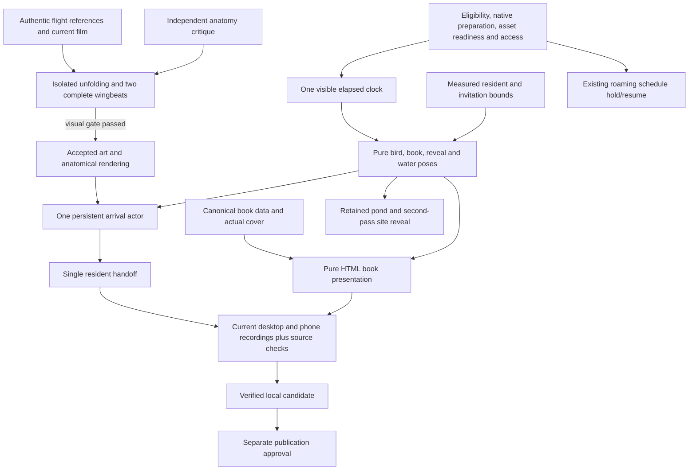

> Status — IMPLEMENTED AND VERIFIED LOCALLY, September 10, 2026. The isolated study and integrated four-viewport artistic review passed. The opening now shares the accepted anatomical renderer, and a focused follow-up accepted the resting-body handoff refinement. The frozen production candidate passes all 39 source regressions, types, build and served checks. Production lifecycle/fallback checks, final independent Chromium/WebKit playback, native below-fold replay/late rotation/Skip and unrecorded performance are recorded. Final evidence distinguishes native browser checks from source contracts and retains the startup/visual limits.

## Context

Ben's new objective requires a substantive anatomy study and two purposeful flybys. The preserved local baseline is build `bbTrs4g9kljfX6-Ec1gvs`, prepared from source-manifest SHA-256 `c4c213969db0d52f2dc08819cb3842daaec76a34e6e2eab6d12aee83a8610bfe`. Its historical source/QA records live under `refine-grebe-arrival-film` and `release-artifacts/2026-09-10-grebe-film/wing-revision/`. They establish prior behavior, not acceptance of this new objective.

The existing implementation separates the eligibility/loading controller, shared elapsed timeline, pure choreography, Canvas character and pond, native preparation cover, and measured SVG resident handoff. `GrebeArrivalContext` holds ordinary roaming until preparation/film ownership ends. Those lifecycle contracts are retained; the accepted paired wing plate and articulated flight rig replace the earlier opening wing renderer. The verified replacement now runs locally on port 3112 as build `QsI2QzDIQ1r87XsztmOSc`; the earlier snapshot remains available for comparison and local rollback.

## Goals / Non-Goals

**Goals**

- Establish plausible wing unfolding and two complete strokes in isolation, then use that result throughout the opening.
- Preserve the setting and first story beats; make two distinct left-to-right passes deliver, hold and remove a readable book presentation before a continuous landing.
- Retain immediate access, graceful failure, responsive camera behavior, silence and restrained pond motion.
- Deliver exact-source visual and technical evidence, with the final candidate available locally.

**Non-goals**

Unrelated site redesign, book-content revision, new audio, external animation services, dependency maintenance and publishing are outside this change. The anatomy study is a local development surface without a public navigation/sitemap entry. Prior assets, snapshots and OpenSpec evidence remain intact.

## Decisions

### Resolve anatomy experimentally before integrating it

The root examines authentic grebe flight photographs/video and records the source links, observed joint/feather behavior and relevant perspective. Reference media informs anatomy; it is not silently copied into website assets. Compare the current wing emergence with a near/far silhouette study and a detailed engraving study at normal speed, including unfolding and two full downstroke/recovery cycles. Mark the study gate accepted only after independent visual critique finds that the shoulders, joints, feather overlap and body response read coherently.

Choose the artwork/rig after this inspection. A revised articulated textured rig is a viable option; new near/far wing perspective plates or a different bounded rendering arrangement may be necessary. Reusing the existing single wing image is not a requirement. A simple rotated panel or growth transform cannot satisfy the study by itself. Preserve recognizable body proportions and engraved detail; do not hide anatomy errors with more particles or rapid cuts. Generated artwork needs retained originals/prompts, true alpha inspection and source hashes. Opaque plates with baked backgrounds require deliberate native clipping, not blend-mode concealment.

Current implementation uses the local `/pond-studies/flight` surface, candidate `AnatomicalBird` and `arrivalFlightRig`, plus a generated paired dorsal/ventral plate. `arrivalFlightArtwork` extracts two 1536×512 native silhouettes and caches five opaque view blends; the original full-canvas WebP is 516,910 bytes. Native-pixel and failed-allocation checks pass. Exact provenance, prompt and paper/teal inspection are under `release-artifacts/2026-09-10-two-pass/artwork/`; reference observations and limitations are in the adjacent `reference-research.md`. The neck blocker was resolved by retaining 60% of the established cervical lean rather than forcing a horizontal neck with compressing row translations. A shared five-source-pixel stroke response is phased to the 420 ms wing clock. Transverse-width, bill-proportion and occupied-triangle tests pass; the minimum sampled occupied area ratio is 0.720. Independent study acceptance in `anatomy-critique/final-review.md` applies to the 13 identical before/after source/art hashes and covers desktop/phone normal playback plus two complete cycles. The main opening now uses this same `AnatomicalBird` through the `ArrivalBird` compatibility export.

The main departure unfolds from 3100–3750 ms and develops its flight posture from 3200–4150 ms. Forward travel is capped at 40 px, with hero size capped by 0.98 viewport width, 0.88 viewport height and 840 px. These are main-composition settings; the isolated study uses its own viewport framing and retains the same articulation. A compact engraving quality and brief edge-on recovery profiles remain acknowledged artistic limits.

### Extend the existing visible clock

Pure functions of elapsed time, viewport and measured landing target produce poses for the bird, presentation and reveal. The controller remains the single owner of eligibility, loading and the visible clock. No book timer, CSS animation clock or independent RAF chooses when a pass starts. This keeps tab hiding, Skip, replay and resizing consistent across the longer sequence.

The book and timeline were first constructed and tested in parallel using the previous opening renderer, without waiving the anatomy gate. Historical book evidence in `release-artifacts/2026-09-10-two-pass/book-review/` covers desktop/phone/landscape playback, stationary hold, rotation, Escape, replay and touch Skip. The second-pass/bank tangent has a failing-first continuity regression. After the study gate passed, `integrated-review/README.md` independently accepted the complete anatomical opening at four viewports, including book separation, quiet hold, distinct passes, site reveal and continuous landing.

Use one persistent arrival actor with phase-specific pose/depth and zero opacity between passages. Its hidden interval performs no unnecessary draw work and does not reprepare unchanged artwork. The two passes use distinct visible trajectories; hidden repositioning occurs only fully outside the viewport and during a clear interval. The second pass joins a continuous bank with matching boundary position, scale, orientation and velocity before measured water contact. Preserve an exact single-silhouette resident handoff or revise both representations together if the anatomy solution changes the rest pose.

The implemented and independently reviewed clock lasts 17.6 seconds. The first 8.5 seconds retain waking, shake, departure, feather and ripple; the presentation holds still for 3.3 seconds. The complete frozen candidate retains these landmarks; production playback and unrecorded phase measurements are recorded under `production-review/`.

| Beat | Implemented elapsed time | Reviewed visible result |
| --- | --- | --- |
| Wake, shake, articulated departure | 0–5300 ms | Accepted anatomy within the retained opening |
| Feather fall/contact and quiet ripple | Through 8500 ms | Clear contact before book pass |
| First left-to-right traversal | 8500–9700 ms | Grebe brings presentation into view |
| Presentation finishes settling | By 10000 ms | Small inertial turn ends |
| Quiet reading interval | 10000–13300 ms | 3.3 seconds of stable book information |
| Second left-to-right traversal | 13300–14600 ms | Distinct depth/path removes book and reveals site |
| Continuous bank/descent | 14600–16400 ms | Grebe turns toward measured resident target |
| Water contact and resident handoff | 16400–16650 ms | Continuous settling with no double body |
| Settled completion | 16650–17600 ms | Water calms, ordinary site access resumes |

### Render the actual book as HTML

The implemented `ArrivalBookFeature({ style?: CSSProperties })` component is a pure presentation leaf. Its parent owns all position, scale, rotation, opacity and visibility through the shared pose. The component has no hooks, timers, controls or links. It reuses `AGENT_MEMORY` for title, author, publisher, release label, cover source and alt text; `bookReleaseSummary(chapters)` derives the short update from the canonical live chapter statuses. The current data contains chapters 1–3 live and chapter 4 writing; an intro-specific fixed count would become stale.

Use the actual cover's existing matte crop rather than regenerate its lettering. HTML text remains sharp and allows real bounds/readability checks. The composition uses approximately 550×224 px on desktop and viewport width minus 48 px on a phone. Independent integrated inspection confirms the cover and update remain readable at 320 px width without horizontal overflow. The cover is recognizable while the external title, author and update remain readable. Subtle trailing inertia, a small turn and soft shadow connect the presentation to the first pass. During the hold it is quiet. The second passage removes that same instance, with all movement aligned to the character/reveal pose. No strings, cargo props or extra slogans are needed.

The transient presentation contributes no tab stops. During film ownership, the existing accessible Skip remains the stable action; ordinary book navigation/content stays on the underlying site and returns immediately if the film ends early. Include the exact cover and any new essential anatomy assets in readiness, without adding independent loading deadlines.

### Keep reveal, camera and resident behavior coherent

The pond remains opaque through the first pass and reading interval. Only the second crossing opens the actual site, using its shared progress rather than a timed dissolve unrelated to the bird. Layer order must keep the near/far wings, body and presentation visibly distinct at both phone and desktop scale.

Retain the existing measurement of the resident's non-reflection SVG, full-body bounds, waterline and visible invitation label. Move the page only when those bounds do not fit below the real fixed header, and normally while the opaque scene hides the camera travel. A late resize retargets continuously. Successful completion keeps the landing scroll and focuses the visible invitation with `preventScroll`; Skip/replay interruption restores the prior position, and navigation leaves the new route in control. Avoid moving back after mobile contact merely to recover the initial page position.

The `GrebeArrivalContext` opening flag remains true during unresolved eligibility, essential-art loading and active film. Release it through the existing completion/bypass/interrupt paths. Keep the scheduler's two slots, delay distribution, initial swimmer and peeker rules unchanged. A cinematic actor is not an extra roaming bird; its resident handoff must not add another resident.

### Preserve bounded preparation and resource ownership

The opening readiness list now uses `ANATOMICAL_ART` through its compatibility export plus `AGENT_MEMORY.coverSrc`, so the paired perspective wing and actual cover participate in the existing deadline. `AnatomicalBird.onError` invokes the owning Skip. Browser cases for a missing new wing or cover restore the site, clear locks and resume one swimmer. Factory and renderer fault injection verifies partial buffer disposal, once-only current failure callbacks and inert late callbacks after unmount. Replay renders only after hydration. Final production no-JavaScript and blocked-bundle cases confirm it is not visible before hydration; the earlier development capture remains historical. Production-native tests also exercise malformed, decode-rejected and late wing/cover resources, native Skip with denied storage, session reload/Back and direct anchor bypass.

At final rest, the main Canvas samples the body engraving in one high-quality image draw, matching the resident SVG more closely than independently minified mesh triangles. Independent short-landscape follow-up finds matching outline/placement and close feather detail across handoff. A slight detail change remains during the last fold before handoff; the brief 320 px exit behind the visible Skip action also remains a minor visual limit. Neither was classified as blocking by the independent reviewer.

Keep existing preparation deadlines, hidden-time accounting, session/history bypass, blocked-storage recovery, no-JavaScript access and stale-load cancellation. A failed new wing/detail/cover resource returns to the normal site instead of revealing an incomplete book or stranded overlay. The book remains derived from local data; no network content dependency is added.

Keep character and pond buffers capped at their existing limits, reflection reuse where visually valid, static alpha coverage caching and cleanup on unmount. New art may increase preparation cost; record actual download bytes, decoder/canvas allocations and setup time. Fresh sequential, unrecorded Chromium 147.0.7727.15 runs at 1440×900/DPR1 and 390×844/DPR3 measured phase intervals separately from video. Every phase median was 8.3 ms; desktop launch p95 was 16.7 ms, other p95 values were at most 9.3 ms. Both runs included an initial artwork-preparation long task, 128 ms desktop and 126 ms phone viewport. Those pauses are a real retained limitation; the results do not support a zero-stutter claim. The observational RAF intervals describe scheduling on this host, not every paint or physical-device performance.

The six essential encoded source assets total 2,678,244 bytes. Observed maximum individual character canvases were 1,998,630 and 1,199,968 pixels. Encoded bytes do not represent decoded graphics memory or total page transfer. Raw metrics, asset hashes, final cleanup state and limits are retained in `production-review/performance.json`, `performance.md` and `asset-inventory.json`.

## Risks / Trade-offs

- **A plausible silhouette still looks mechanical in motion** → Review full unfolding and two consecutive cycles at normal speed; inspect adjacent recovery and shoulder frames before integration.
- **Reusing one texture produces impossible near/far perspectives** → Allow perspective-specific art or revised deformation; document the selected solution after the study.
- **The longer presentation feels promotional or hard to read** → Keep one concise canonical update, restrained typography and an actual timed phone review; remove embellishment before sacrificing the quiet hold.
- **Two traversals look like an unexplained teleport** → Make each visible crossing complete, separate them with the reading interval and join the second pass to a continuous bank; test boundaries and inspect normal-speed depth cues.
- **New artwork introduces decode delays or frame hitches** → Include it in readiness, prepare once, retain bounded buffers and record current setup/per-phase costs.
- **The landscape camera cannot fit bird and label** → Measure both below the actual header, retain the short-landscape invitation arrangement, and test rotation/replay from below the fold.
- **A green release gate obscures visual defects** → Independent critique and current recordings are required evidence with explicit unresolved findings.

## Migration Plan

1. Preserve the known production-mode local baseline and its historical records while the anatomy study runs separately.
2. Pass the study gate, implement/integrate locally and run focused regressions after each meaningful change. Do not replace port 3112 with an unverified partial sequence.
3. Freeze application source and art, run the existing Node 22 local `release:prepare` gate, and retain its source manifest, logs and rollback metadata under a new evidence directory for this change.
4. Start the verified snapshot as the persistent local preview on port 3112 after coordinated shutdown of the owned prior preview. Verify its served build identity, then capture final desktop/phone/browser evidence. Preserve the prior snapshot for local rollback.
5. Record review findings, final timing, art provenance and remaining limits. Request publication approval only after the concrete local candidate is ready; no push, hosted preview or deployment is part of this implementation.

## Resolved decisions and retained limits

The implementation decisions below are supported by retained source and browser evidence. Publication remains outside this local change.

- The anatomy, departure timing, pass separation and 3.3-second quiet hold have been resolved through the recorded independent study and integrated reviews.
- Unrecorded phase measurements and the exact production source/build are now recorded. The source manifest is `bb9cb299a1fa46e8aa5c98eb28900b8de26985dba6b75bc32c5b7208eb4d1be7`; `production-review/preview-identity.json` verifies the served manifest matches snapshot `econoben-release-1Wilcd/source` byte for byte.
- Production-native lifecycle/fallback and independent Chromium/WebKit results belong to that candidate. Actual native tab switching did not make `document.hidden` true in the review runtime, so native pause is unverified. Exact source-clock coverage remains recorded separately; no synthetic event is presented as a native result. Final documentation differs from the frozen source only as an evidence update, with application identity unchanged.

Final independent production results are in `production-review/independent/results.json`. Chromium desktop/phone and WebKit phone/short-landscape complete with the article action focused. Native replay begins below the fold at scroll 803, rotates during banking at 15051 ms and completes at scroll 549 with the invitation below the 114.9375 px header; a second replay interrupted by Skip restores scroll 1135 and Replay focus. The actual resident pointer/dive interaction opens `/posts/publishing_for_oreilly`. The first WebKit landscape completion wait expired at 21 seconds, but its subsequent state was complete; the retained fresh repeat passed. These functional recordings are separate from performance measurements. Chromium 147.0.7727.15 and WebKit 26.4 were exercised locally; physical devices and the Safari application were not tested. All owned reviewer browsers are closed and the verified 3112 preview remains available for delivery.
