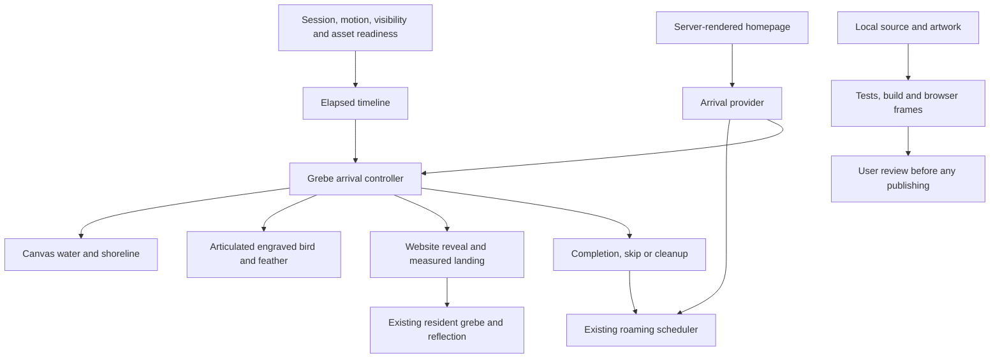

> Status: COMPLETE LOCALLY. Reviewable implementation; publishing remains held.

## Context

The feature worktree contains the six accepted reading/release improvements and the subsequent removal of the interactive memory example. All changes are preserved. The new request explicitly permits a large focal grebe and a full opening, extending the otherwise restrained background treatment.

## Goals / Non-Goals

**Goals.** Build the complete requested movement with fine engraved artwork, continuous physical timing, responsive pond scenery, a convincing reveal and a landing that joins the actual site. Make the whole sequence skippable, silent and bounded.

**Non-goals.** Authentication, audio, new roaming animals, another memory demonstration, new dependencies, a site redesign or publishing. Do not alter the current book cover or chapter status.

## Decisions

- Root owns generated artwork, visual composition, scoped CSS, homepage integration and OpenSpec. Reading agent owns the pure timeline/lifecycle hook and its tests. Book agent owns an elapsed-time-driven Canvas pond. Release agent owns the shared arrival context and scheduler hold, then reviews integration.
- Use a fine ink-and-gouache adult horned grebe, matching the existing identity. Build the wings as separate articulated layers so takeoff uses continuous wingbeats rather than switching between unrelated pictures. Keep original art files and add versioned web assets.
- Use warm ivory `#f7f2e8`, pale sage `#d8e1cf`, water teal `#527f72`, deeper teal `#173f3d`, rust `#b46335` and natural ochre `#d6a03b`. The canvas includes shoreline/reeds, reflected light and perspective contours rather than star-like decoration. Only the Skip opening/Replay opening controls need text.
- A single elapsed clock drives every visual. Initial timing is 0–1900ms waking, 1900–2800ms shaking, 2800–4700ms vertical launch, 4700–6500ms falling feather, 6500–7300ms contact ripple, 7300–8500ms crossing/reveal, 8500–10000ms landing, and 10000–11300ms settling. Tune visible motion after browser review without losing any beat.
- The lifecycle hook preloads a bounded asset set, checks session storage and motion preferences, pauses visible time in hidden tabs and cleans up on unmount. The site itself stays server rendered. An inaccessible or failed animation must not block the page.
- A provider outside the homepage frame holds the roaming scheduler before ordinary visits. The landing destination is the resident bird in `.field-pond-scene > .study-scene-art`, measured with the SVG transform of `(321,263)` in the 800×440 viewBox. Hide the resident and reflection only during their visual replacement, then reveal them at contact.
- Desktop uses the visible pond target directly. On phones, inspect the actual below-fold destination and use a short controlled camera adjustment during the covered portion if needed; restore the arrival scroll position before normal access resumes. Skip and history restoration must never leave an unexpected scroll position.
- Lock underlying pointer/keyboard access only while the full opening is active, give the Skip control focus only when necessary, and restore prior interaction state on every exit. Replay is a small deliberate control, not another large homepage section.

## Risks / Trade-offs

- A long opening could delay reading → once per session, discreet skip, no deep-link/history interruption and reduced-motion bypass.
- Disconnected poses could look like a slideshow → identity-matched artwork, articulated wings, stable body and continuous transformation.
- Alpha artifacts could produce a box around the bird → inspect generated alpha and render against the actual pond before accepting assets.
- Mobile pond can begin below the viewport → measure the real SVG target and verify the full reveal/landing sequence at 320/390px.
- CSS-only hiding could let timers advance → the shared context cancels the existing scheduler while opening and restarts its unchanged schedule afterward.
- Earlier release records omit this feature → retain them as history and prepare new exact-source evidence after all animation fixes.

## Migration Plan

Implement and review locally, keeping source assets intact. Record playback captures, controls/failure tests and source/build evidence. Publishing and any Git/Vercel reconciliation remain held for a later explicit approval.
