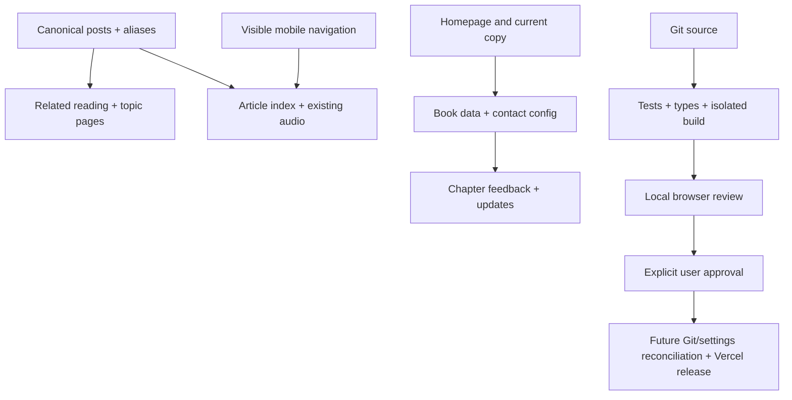

> Status: REVISED LOCAL IMPLEMENTATION VERIFIED. The interactive memory example is removed; six retained areas pass validation. No deployment or Git-triggered publishing without explicit approval.

## Context

Baseline source is branch `feat/grebe-field-notes` at `8b8c4485`; production application source is `608f879b`. The branch is already a separate worktree. Existing generated `.next`/TypeScript changes are preserved. The prior release and share-card work remains accepted. No Beads usage; its legacy hooks are retired.

## Goals / Non-Goals

**Goals:** Complete the six retained recommendations: caching, release workflow, mobile navigation, reading/discovery, book experience, and current editorial copy with observable improvements on desktop/phone and repeatable local release verification. Preserve post URLs/content, social v3 artwork, exact book cover, three live chapters/Chapter4 next, silent fluid dive, peeker, immediate first swimmer, maximum two swimmers, and reduced-motion behavior.

**Non-Goals:** An interactive memory demonstration or any replacement for the rejected example. Deployment, automatic hosted previews, external subscriber submission, mailing-list migration, new dependencies, broad manuscript edits, new artwork, or redesigning the accepted pond. No remote main merge or Vercel mutation while its release implications await approval.

## Decisions

### Ownership and integration

Release agent owns config/package/Makefile/build-release scripts/docs/Git generated-file index cleanup. Reading agent owns post service/topic helpers/tags/article renderer and reading controls. Book agent owns book page/data/chapter component/newsletter and isolated book CSS. Root owns shared header/frame, home/About current copy, contact config, removal of the rejected demonstration, integration and OpenSpec. Agents use separate CSS files and do not edit globals or each other's files. Parent coordinates interface changes.

### Visual direction

Retain ivory `#f7f2e8`, ink `#211e1f`, teal `#176b69`, deep water `#173f3d`, muted sage `#6d7d68`, and restrained rust `#b35d39`. Existing headline sans identifies actions and structure; existing serif supports readable explanations. Apply the existing publication typography and spacing to navigation, book actions, and article controls. No puns, novelty labels, blinking controls, generic dashboard stats or extra roaming animals.

### Reading model

Centralize explicit conservative aliases. Preserve distinct specialist tags; merge spelling/plural synonyms rather than aggressively deleting the taxonomy. Reuse real post data to rank explicit references first, then meaningful shared subjects. Never fabricate semantic relations. Existing links resolve aliases. Generate unique heading IDs using the same rule as the markdown renderer. Keep chronological links distinctly labeled. Existing audio is user initiated and appears once near the article start.

### Book and contact

Use the established About contact provisionally while the early user question is pending. Centralize it in `app/config/contact.ts`; chapter mailto subject/body identifies title and number. A book form explains chapter updates are included with occasional new-writing updates unless actual preference persistence is implemented and verified. Do not promise book-only subscriptions without backend support. Verify any O'Reilly chapter deep links; otherwise preserve the known working book destination.

### Release safety

Prefer one authoritative cache config. Remove immutable policy from mutable articles/media and avoid overriding `_next/static` framework behavior. Make default builds non-destructive. A preparation command creates a disposable source snapshot and evidence; publishing is a separate explicit action. Read-only inspection of current remote/main/Vercel config supports an exact reconciliation plan. Do not run that plan until deployment approval covers Git auto-release behavior. Untrack generated files using index-only removal, preserving worktree files. No public self-hosted runner, broad action changes or secrets.

### Removal after user review

The user rejected the interactive memory example after reviewing the initial local implementation. Remove `/memory`, its dedicated components/styles/test, and every homepage, book, menu, and sitemap entry that introduces it. Preserve the accepted grebe animation and the six retained improvements. Do not replace the removed feature with a stub, alternate demonstration, or promotional link. Earlier implementation and review evidence remains in `validation.md` as history; its source manifest no longer certifies the revised application.

## Risks / Trade-offs

- Alias merges can lose routes/counts → fixture regressions and real-corpus/URL checks.
- Heading links can drift from rendering → shared slug logic and duplicate/punctuation tests.
- CSS cascade can flatten book/nav type → isolated scoped CSS and actual desktop/phone screenshots.
- Removed demonstration links or assets can survive in shared surfaces → search the application, test configuration and sitemap, verify `/memory` is absent, and inspect home/book/mobile navigation again.
- Cache changes cannot purge already immutable browser entries → preserve versioning, document browser-cache limitation and test revalidation using a returning local browser.
- Remote reconciliation could deploy → prepare exact commands and hold execution behind user approval.

## Migration Plan

Complete the requested removal and validate the revised source locally, then present the six retained improvements. The previous release snapshot is superseded and must not be published as the accepted revision. After approval, reconcile the approved source/remote branch, align verified Vercel settings, deploy from the verified revision, and repeat live crawler/cache/navigation checks with prior deployment retained for rollback. This task stops at the review gate unless approval arrives.
