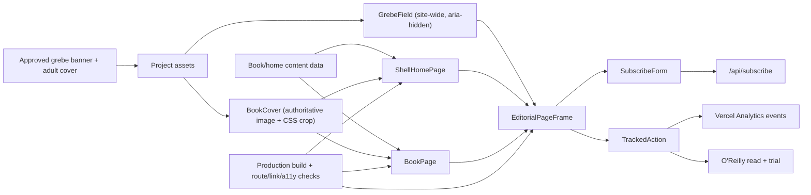

> **Status:** READY FOR REVIEW — implemented on 2026-07-30 in draft PR
> [#79](https://github.com/EconoBen/blog/pull/79).

## Context

The production site at `econoben.dev` is a Next.js App Router application,
currently building with Next.js 16.2.2. Production baseline `ff68ffb6` already
carries the editorial shell, the working
O'Reilly Early Release CTA, and the July 30 fix that removes the duplicate book
signup. The remaining refresh must preserve the wider personal platform while
making the real book and grebe identity unmistakable.

The strongest existing visual language is the approved LinkedIn banner: subtle
ivory paper, modern charcoal typography, sparse adult horned grebes drawn with
ink and restrained gouache, teal water ripples, and rust/ochre accents. The
mascots are supporting actors. They cannot compete with articles, controls, or
the exact O'Reilly cover.

The current site also carries a large legacy `globals.css` file. A broad mobile
rule applies `width: 100%` to every `button`, which breaks the shared newsletter
form. This refresh must isolate new styling behind explicit component classes
and narrowly repair the legacy rule without attempting a whole-site CSS rewrite.

## Goals / Non-Goals

**Goals:**

- Make the current Early Release book and exact adult-grebe cover authoritative
  across the homepage, `/book`, and metadata.
- Repair the remaining conversion defects and make the funnel observable.
- Give the full shared site frame a coherent, engaging grebe editorial identity
  while keeping writing and navigation first-class.
- Replace repeated card-board composition with differentiated editorial beats.
- Ship a responsive, reduced-motion-safe, accessible implementation that is
  production-buildable and link-checked tonight.
- Leave an execution record that another agent can resume without reconstructing
  decisions.

**Non-Goals:**

- Recompose every route or turn pages into grebe-heavy canvases; the shared
  paper pond is a background system, not a route-by-route redesign.
- Change post bodies, talk content, publications, CV details, code-tool data, or
  the established route inventory.
- Regenerate or reinterpret O'Reilly cover typography, logos, or publication
  artwork.
- Introduce a second analytics provider, behavioral replay, advertising pixels,
  or user-level tracking.
- Rewrite the entire legacy stylesheet in this delivery.
- Merge directly to `main` without review.

## Architecture

## Decisions

### 1. Use the supplied cover as an immutable source asset

The supplied `linkedin_portrait_dark.png` will be copied unchanged into the
project. A `BookCover` component will crop the surrounding presentation matte
with an overflow-hidden frame and responsive image positioning; the source
pixels and O'Reilly artwork will not be regenerated.

Alternatives considered:

- **AI-remove or redraw the dark frame:** rejected because generated edits can
  alter authoritative text, logos, color, or the bird illustration.
- **Keep the blue draft placeholder:** rejected because it is factually and
  aesthetically superseded.

### 2. Build one decorative grebe sprite sheet and a code-defined field

Image generation will produce a small set of consistent adult horned grebe
mascot poses derived from the approved banner, on a removable chroma-key field.
The final transparent WebP/PNG will be stored in `public/assets/grebes/`.
`GrebeField` will position instances from declarative data rather than baking a
new full-page image for each route.

Alternatives considered:

- **Use the entire LinkedIn banner as a repeating background:** rejected because
  it would create text collisions, visible repetition, and a book-microsite feel.
- **Generate a separate full-page background per route:** rejected because it is
  less responsive, less accessible, harder to tune, and heavier to load.
- **Draw generic CSS birds:** rejected because the approved mascot identity and
  line quality are important to Ben's brand.

### 3. Make the paper pond site-wide while keeping motion presentation-only

At most two instances per viewport will use long-duration transform/opacity
keyframes to make a calm full-width swim. The shared editorial frame will own
the field so every route receives the same paper-and-grebe identity without
copying banner text or book imagery into a background. `GrebeField` will be
`aria-hidden`, `pointer-events: none`, isolated behind content, and frozen
inside `prefers-reduced-motion: reduce`.

Alternatives considered:

- **JavaScript parallax tied to scrolling:** rejected because it adds runtime
  weight, motion sensitivity, and input complexity without improving the funnel.
- **Animate every bird:** rejected because it competes with reading and turns
  the system into a novelty.

### 4. Recompose rather than merely recolor the funnel

The book page will consolidate audience/questions/outcomes into fewer editorial
beats. The sequence will be:

1. Hero with exact cover and read-now action.
2. “Available now” proof strip and Early Release feedback value.
3. A compact build-outcomes ledger with one contextual mascot.
4. The corrected three-part chapter map.
5. The single shared subscription close.

The homepage will retain the writing-first hero and real latest post data, but
the book will be updated to Early Release and given a real-cover treatment.
Grebes will live in the page field and transitions rather than inside every card.

Alternatives considered:

- **Keep every current card grid and add decoration:** rejected because it fixes
  brand recognition while preserving the page's flat pacing.
- **Make the homepage a book landing page:** rejected because the site must
  continue to introduce posts, talks, publications, tools, and Ben's CV.

### 5. Add a small tracked-action boundary

Vercel's existing `@vercel/analytics` dependency will be mounted once in the root
layout. A client-side `TrackedAction` wrapper/helper will send stable events for
book, trial, and homepage funnel actions before allowing the underlying link to
behave normally. `SubscribeForm` will emit success only after a successful API
response. Event payloads will contain placement labels, never email content.

Alternatives considered:

- **Rely only on O'Reilly UTMs:** rejected because those tags do not measure
  newsletter success or the homepage-to-book step inside Econoben.
- **Add a second analytics vendor:** rejected because Vercel Analytics is already
  installed and sufficient for this funnel.

### 6. Repair legacy mobile form CSS narrowly

The broad mobile `button { width: 100% }` rule will be scoped away from the
editorial shell or overridden by explicit newsletter control classes. The form
itself will stack at the smallest width and use a row only when both input and
button have usable space.

Alternatives considered:

- **Delete all legacy mobile rules:** rejected because unrelated routes still
  depend on parts of the accumulated stylesheet.
- **Accept the collapsed input because the submit button remains visible:**
  rejected because it makes the conversion control unusable.

### 7. Validate in a production server, not only `next dev`

The repo's previous redesign record identifies stale development chunks as an
unreliable review surface. Final browser checks will run after `npm run build`
against `npm run start`, with fresh desktop/mobile screenshots and a route/link
audit.

## Risks / Trade-offs

- **[Generated mascot variants drift from the approved grebe]** → Use the banner
  and adult cover as references, reject chick/duck/penguin traits, inspect the
  output at small size, and fall back to fewer accepted poses rather than using
  weak variants.
- **[Chroma-key removal frays feather edges]** → Use a magenta key, soft matte,
  despill, and edge validation; if it still fails, keep the bird on a matching
  ivory tile rather than silently switching models or altering the style.
- **[Decoration hurts performance]** → Use one optimized sprite asset, responsive
  sizing, CSS transforms only, no scroll listeners, and lazy loading for
  below-fold nonessential instances.
- **[Legacy CSS leaks into new components]** → Namespace the grebe and funnel
  classes, add targeted responsive tests, and avoid broad selector additions.
- **[Analytics blocks navigation]** → Fire events as best-effort side effects;
  links and API success remain authoritative.
- **[External sites reject automated probes]** → Fall back from HEAD to GET and
  record browser verification for anti-bot responses instead of declaring a
  false broken link.
- **[Current book status changes during implementation]** → Keep release status,
  availability, and chapter data centralized in one module for easy updates.

## Migration Plan

1. Create and validate this OpenSpec change on a branch based on current
   production `main`.
2. Add immutable source assets and generated mascot outputs.
3. Introduce `BookCover`, `GrebeField`, and tracked-action primitives with tests.
4. Mount analytics and repair `SubscribeForm` mobile behavior.
5. Update centralized book data, root metadata, homepage, and book page.
6. Run formatting, types, component/unit tests, OpenSpec validation, and
   production build.
7. Start a production preview and run route, link, accessibility, and responsive
   browser checks with screenshots.
8. Push the review branch and open a draft PR. Do not merge without Ben's review.

Rollback strategy: remove `GrebeField` from the shared frame, restore the
previous homepage/book components, and retain the independent correctness fixes
(real cover, current copy, chapter structure, signup repair, and analytics) if
the visual direction needs another iteration.

## Open Questions

- The final number of accepted sprite poses depends on image-generation quality;
  the system works with as few as three.
- The current authoritative manuscript state says Chapters 1 and 2 are live,
  Chapter 3 is submitted, and Chapter 4 is in writing. This implementation will
  keep those status values centralized so a later O'Reilly release update is a
  data edit rather than a page rewrite.

## Implementation Evidence

- **Baseline:** `origin/main` at `ff68ffb6`; implementation branch
  `feat/grebe-editorial-refresh`; the primary checkout's pre-existing tracked
  `.next` churn was left untouched.
- **Immutable cover:** copied from
  `/Users/blabaschin/Downloads/linkedin_portrait_dark.png` to
  `public/assets/agent-memory-cover-early-release.png`; SHA-256
  `3d60db306f84a32f09604ffa852ee5c55ccf756682e7323114857ef1c98ff300`.
- **Identity reference:** the approved banner remains external at
  `/Users/blabaschin/.codex/skills/animal-editorial-design/assets/grebe-banner-anchor.png`;
  SHA-256
  `e89145fbb9a61847070bf218f5bdc1ceb9ad49403ca8429084b1a09a9a02dacb`.
- **Generated decoration:** one keyed 2×2 mascot source was generated from the
  approved adult-grebe identity, chroma-removed with soft matte/despill, and
  stored as `public/assets/grebes/grebe-mascots.png` (1254×1254, alpha, 596 KB).
- **Rendered design:** the shared frame owns route-aware home/book/site fields;
  desktop uses seven or eight mascots with two 52–61 second cross-screen
  transforms, and mobile uses three or four with at most one visible mover.
- **Funnel:** exact cover, current release copy, corrected Part I/Part II
  boundary, one subscription target, O'Reilly read/trial actions, and named
  Vercel events are all centralized and source-asserted.
- **Responsive evidence:** browser review passed at 390, 768, 1024, and 1440
  CSS pixels without horizontal overflow. The mobile email field renders at
  330×49 px; compact navigation retains Book, Home, Posts, Talks,
  Publications, Code & Tools, About, Tags, and Search.
- **Accessibility evidence:** browser checks found one `main`, one `h1`, no
  missing image alternative text, unlabeled email controls, empty links,
  duplicate IDs, or horizontal overflow on the primary reviewed routes. The
  grebe layer is `aria-hidden` and pointer-transparent; compiled CSS contains
  the complete `prefers-reduced-motion: reduce` freeze.
- **Link evidence:** the production server crawl passes 232 internal routes.
  The O'Reilly book and trial links load as `Agent Memory [Book]` and
  `Create Your Trial: O'Reilly`. A pre-existing missing 37 MB memorial video
  was recovered from history as a 1.7 MB MP3, preserving the listening link
  without reintroducing the deployment-blocking video.
- **Build evidence:** `npm run test:grebe-refresh`, `npx tsc --noEmit`,
  `openspec validate launch-grebe-editorial-site`, and `npm run build` pass;
  the production build generates the full 159-page route table.
- **Deployment evidence:** Vercel reports success for PR #79. The
  [deployment preview](https://blog-git-feat-grebe-editorial-refresh-bens-projects-0b44e0e4.vercel.app)
  and its homepage, `/book`, cover, mascot sprite, and repaired audio asset all
  return HTTP 200.
- **Known tooling exception:** the pre-existing `npm run lint` script cannot
  execute because this repository does not install ESLint or an applicable
  configuration. The refresh does not change the project's lint toolchain.
