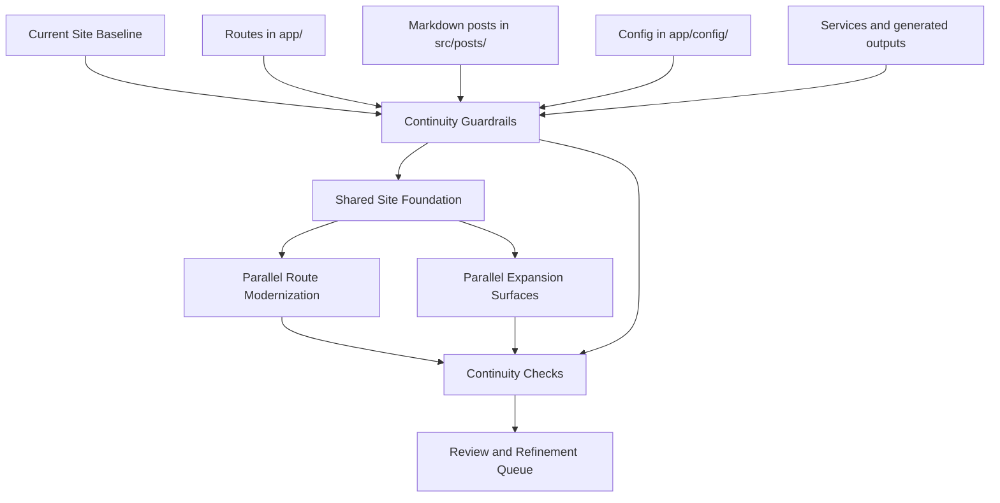

## Context

The `blog` repo is the implementation target for the public site at `econoben.dev`. It is a Next.js App Router application with content and behavior spread across route components in `app/`, config-driven sections in `app/config/`, markdown posts in `src/posts/`, and service logic in `app/services/`.

The current working tree already contains exploratory editorial redesign work, including a new shell and a `/book` route. That work should continue, but it must not cause silent loss of content or features from the existing site. The canonical baseline is still the current site as currently implemented and shipped: its routes, wording, content corpus, metadata, feeds, and user-visible behaviors.

This change exists to prevent content loss while the redesign moves forward. Without continuity guardrails, the migration can easily drop posts, routes, metadata, or feature surfaces while the new visual system is being built.

The first implementation wave is already split into stacked draft PRs for the shared foundation, structured pages, posts, discovery routes, and continuity-backed surfaces. The next wave should move from "safe continuity" toward "closer to final" by using an integrated preview branch plus focused polish branches for shared visual fidelity, language, and subpage refinement.

The latest design input is a Stitch-generated multi-page site family built from the active OpenSpec brief plus uploaded Figma references. That pass produced both mobile and desktop route families, but the desktop/web outputs are the more useful implementation target. They reinforce a calmer editorial shell, a Ben-first homepage, cleaner list-based discovery pages, narrower long-form reading layouts, and more normalized archive/tag/search/code-tool families. They should guide implementation, but not be treated as codegen or content truth.

The combined preview makes the remaining issues concrete. The site is now directionally coherent, but several routes still reveal their transitional state: `About` is cramped, `Book` still reads like a placeholder, `Publications` and `Talks` are still card-grid heavy, `Posts` remains too dense, and `Code & Tools` still feels like a separate product rather than part of the same editorial platform.

The latest review adds a sharper constraint: the redesign must become more practical and less self-conscious. In the current preview, the site gets weaker when it starts narrating itself with labels like "essays," "pieces," "appearances," "major publications," and "featured entries," or when it introduces visual devices such as proof strips and metric sidebars that do not help people actually use the page. The old site handled some of this better, especially on `Talks`, where embedded media made the page immediately useful and about-page content still behaved like a real CV.

## Goals / Non-Goals

**Goals:**
- Preserve the existing public site's routes, posts, wording, and feature surfaces while the redesign proceeds.
- Allow redesign and expansion work to move forward in parallel once content-continuity guardrails are in place.
- Make content loss obvious through lightweight inventories and checks instead of a heavyweight parity chart.
- Keep copy changes deliberate by freezing existing wording unless a later explicit change approves them.

**Non-Goals:**
- Rewriting copy accidentally during layout or design work.
- Treating exploratory design changes as permission to drop existing content or behaviors.
- Building a formal route-by-route parity spreadsheet or chart as a prerequisite to development.
- Redesigning the content model at the same time as the site shell unless continuity is preserved.

## Decisions

### 1. The canonical baseline is the current site, but redesign work can proceed in parallel
The migration source of truth is still the current public site and its existing repo behavior, but the redesign does not need to wait for a formal parity signoff. Instead, the redesign proceeds while continuity guards prevent regressions.

Alternatives considered:
- Use the exploratory redesign as the new baseline: rejected because it makes it too easy to lose content or routes accidentally.
- Freeze all redesign work until parity is finished: rejected because it slows progress unnecessarily and is not what the user wants.

### 2. Use lightweight continuity inventories instead of an explicit parity chart
We still need to know what must be preserved, but that inventory should be operational and lightweight: canonical content sources, public route surfaces, feature-backed routes, and generated outputs.

Alternatives considered:
- Build a formal parity matrix for every route before coding: rejected because it adds planning overhead without enough additional protection.
- Skip inventory entirely: rejected because it makes missing content harder to catch.

### 3. Existing wording is frozen by default during redesign
Canonical wording remains in place unless a deliberate change later chooses to rewrite it. Layout and design work do not get to rewrite copy by accident.

Alternatives considered:
- Allow opportunistic copy cleanup during redesign: rejected because it makes it harder to separate design work from content decisions.
- Rewrite top-level copy immediately: rejected because the user wants to keep current wording until intentional revisions are discussed.

### 4. Expansion work is allowed as long as continuity protections stay in place
Book surfaces, newsletter placement, and editorial refinement can be built while route modernization is underway, provided they do not remove baseline content or silently replace existing wording.

Alternatives considered:
- Force all expansion into a later change: rejected because the user wants to keep building the site now.
- Allow unrestricted expansion with no guardrails: rejected because it increases the risk of losing content or features.

### 5. Validation focuses on continuity, not perfect one-to-one parity
Automated build/runtime checks plus targeted human review are enough, as long as they confirm that posts, routes, metadata, and feature surfaces still exist and work.

Alternatives considered:
- Rely only on `next build`: rejected because content loss can still slip through.
- Require exhaustive visual parity review for every route before building new surfaces: rejected because it over-constrains progress.

### 6. Use Stitch desktop outputs as design reference, not implementation truth
The Stitch project is useful as a design extraction step because it extends the homepage direction into a complete site family. The correct use is to borrow information architecture, hierarchy, pacing, and calmer visual language from the desktop outputs while keeping the real site's content, behaviors, and tone constraints.

Alternatives considered:
- Ignore Stitch and continue from ad hoc editorial exploration: rejected because the multi-page desktop pass clarifies the page family more concretely.
- Treat Stitch as direct codegen or literal copy source: rejected because it invents fake content and occasionally drifts into generic product/newsletter patterns.

### 6. The design thesis is practical, direct, and content-first
The site should feel useful, grounded, and easy to navigate. Labels should describe what the content is in plain terms: posts, talks, publications, resume. Visual emphasis should come from the content itself, not from self-promotional metrics or decorative summary bands.

Alternatives considered:
- Keep the more self-consciously editorial language: rejected because it reads as pretentious and obscures what the pages actually are.
- Lean harder into metrics and "at a glance" cards: rejected because the current review shows they create awkward empty space and bragging cues more often than useful orientation.
- Treat the about page as a pure narrative page instead of a CV: rejected because the old site’s resume-first utility is still part of what the page needs to do.

### 7. Talks should prioritize watch/listen utility over summary framing
The current rewritten talks page degrades compared with the old implementation because it removes the embedded media experience and replaces it with summary metrics and generic framing. The correct direction is to restore embedded playback and make the page easy to browse and consume directly.

Alternatives considered:
- Keep the "latest appearance" / "recorded appearances" framing: rejected because it reads as bragging and is less useful than embedded media.
- Keep abstract proof strips about venues: rejected because they do not help the user decide what to watch.

### 8. Navigation should include an explicit Home destination
The brand link is not enough as the only way back to the homepage once the site has more destinations. The editorial shell should expose a clear `Home` entry in navigation.

Alternatives considered:
- Rely on the site title/brand only: rejected because explicit wayfinding is clearer and more practical.

## Architecture

## Risks / Trade-offs

- **[Redesign work can still hide regressions]** → Add lightweight continuity checks for posts, routes, outputs, and feature-backed pages.
- **[Existing exploratory code may diverge from current behavior]** → Keep the current site as the content/feature source of truth even when the new design moves ahead.
- **[Current repo has tooling gaps]** → Record repo-level validation limits, such as missing ESLint wiring, and lean on build/runtime plus targeted review until stronger checks exist.
- **[Parallel work can blur content vs design decisions]** → Freeze wording by default and track intentional copy changes separately.

## Migration Plan

1. Freeze the parity baseline: route inventory, content inventory, wording freeze, and known exploratory deltas.
2. Build the shared site foundation so redesign work can move ahead without orphaning baseline routes and features.
3. Modernize content routes and expansion surfaces in parallel while preserving existing content sources and wording by default.
4. Verify dynamic systems and outputs: search, tags, archives, code-and-tools, metadata, RSS, sitemap, and robots.
5. Review the redesigned site for continuity gaps, then queue copy/book/newsletter refinements for the next pass.
6. Create an integrated preview branch from the active stacked slices and run a second pass for shared visual fidelity, language, and subpage polish.
7. Use the Stitch desktop outputs to define the next refinement wave for the shared shell, homepage, long-form reading, talks, discovery surfaces, and code/tool pages.
7. Run a combined-preview review, then launch another polish wave for structured pages, discovery density, and code/tools shell alignment.
8. Run a practical-refinement wave that removes pretentious language, restores useful embedded media where the old site was stronger, and re-centers the about page on CV utility.

## Execution Constraints

- Implementation proceeds on non-`main` branches only.
- Parallel implementation should use git worktrees so multiple route families can advance independently.
- Each parallel slice should land in its own PR and remain unmerged until human review approves the branch set.
- Shared foundation work that changes common files such as layout shells, shared components, or global styles should establish the integration base first; page-specific work should branch from that base to reduce conflicts.
- Once multiple draft slices exist, an integration preview branch may stack them together so later polish work can target the real combined experience without merging anything into `main`.
- Combined previews should drive refinement work. New polish slices should be based on rendered-page review rather than on abstract theme descriptions once a stacked preview exists.
- PRs created for this change are review checkpoints, not merge signals. Nothing should be merged into `main` until the user explicitly approves it.

Rollback strategy:
- If a redesign slice drops route availability, content coverage, or feature continuity, revert that slice to the last safe state rather than layering more design work on top.

## Open Questions

- What is the minimum continuity check set that gives enough protection without turning into the formal parity chart you do not want?
- How visible should `/book` be while the broader site redesign is still preserving baseline content and wording?
