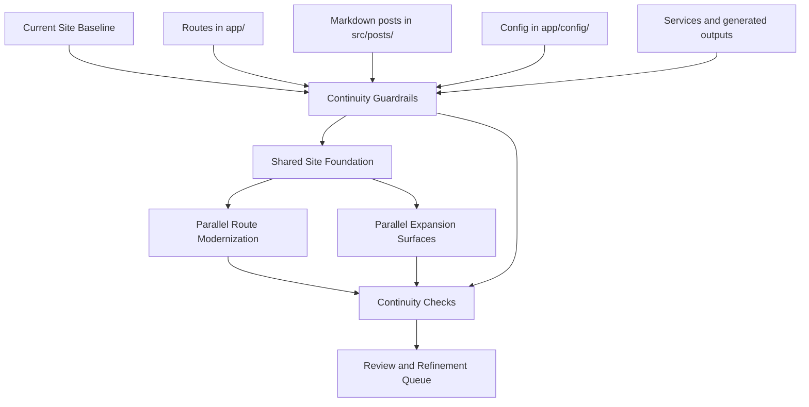

## Context

> Status note (March 23, 2026, direct user review correction): the earlier “close” assessment on several tabs was too optimistic. Direct human review overrode it for four routes: `/posts` still reads as an underpowered yearly ledger, `/about` has dropped too much of the baseline CV detail, `/talks` still spends too much of the top fold on clutter, and `/code-ai` still feels rough and amateurish next to the stronger editorial tabs. Those are now first-class blockers, tracked explicitly as `blog-mkj.2` / `#69`, `blog-qxn.1` / `#67`, `blog-r0j.1` / `#68`, and `blog-vt2.1` / `#66`.

> Status note (March 23, 2026, wave-7 structured-content pass): the next weakest family after the home/code-tools cleanup was `talks` and `publications`, so that pair received another focused production pass. `/talks` now opens with less duplicated helper chrome, a softer browse rail, and grid mode as the default archive view so the page reads as an editorial archive before it reads as a control board. `/publications` now uses a quieter archive-map block in the hero instead of a sticky side rail, and the featured publication card no longer dominates the first fold as heavily. Fresh production screenshots under `.playwright-discovery/tab-audit-20260323-wave7-final/` show both routes runtime-clean and much closer to the stronger pages; remaining work is increasingly whole-site judgment rather than obvious per-route breakdowns.

> Status note (March 23, 2026, wave-6 focused composition pass): one more production rebuild and focused Playwright recheck on `http://127.0.0.1:3017` tightened the last two active composition problems from wave 5. On the homepage, the archive support rail no longer forces the lead archive card to stretch to an awkward shared height, and the right rail now starts more cleanly with a compact label row instead of explanatory filler. On `/code-ai`, empty categories are no longer rendered in the browse controls, which reduces the remaining dashboard feel without changing route behavior. The remaining gap is now mostly final judgment rather than a concrete broken composition: home and code-tools are much closer, but both should stay open until one more whole-site pass confirms they sit naturally beside the strongest editorial routes.

> Status note (March 23, 2026, wave-5 focused calmness pass): a targeted production rebuild and Playwright recheck on `http://127.0.0.1:3017` pushed the remaining review blockers further inward rather than wider. The desktop shell is quieter because inactive topbar items now render as text links instead of a full row of inactive pills, the `/posts` archive moved to a calmer single-column year stack with the repeated latest-post CTA removed, `/archive` retained its ledger direction without new regressions, and `/code-ai` now opens more clearly as an archive with search and category controls subordinate to the content cards. The remaining honest frontend debt is now mostly compositional rather than structural: the homepage second screen is improved but still not fully settled, and the code-tools index is better but still denser than the strongest editorial routes.

> Status note (March 23, 2026, wave-4 production audit and recheck): the production review baseline is stable again after removing a stale duplicate `src/app` scaffold that was causing the recurring `/_document` build failure in this worktree. A clean `npm run build` now completes again, `next start` is back on `http://127.0.0.1:3017`, and fresh desktop/mobile Playwright sweeps were captured under `.playwright-discovery/tab-audit-20260323-wave4/` and `.playwright-discovery/tab-audit-20260323-wave4-recheck/`. The site is runtime-clean, the measurable post-detail mobile overflow bug is fixed, talks/publications now expose stronger first-viewport hierarchy and page-level headings, and the remaining honest frontend debt is narrower: homepage second-screen composition, reading-family calmness on `/posts` and `/archive`, and another desktop hierarchy pass for the code-tools index.

> Status note (March 23, 2026, wave-3 implementation recheck): the follow-up remediation pass from the wave-3 route audit is now applied locally and revalidated in production mode with a fresh `npm run build`, a restarted `next start` preview on `http://127.0.0.1:3017`, and updated screenshots under `.playwright-discovery/tab-audit-20260323-wave3-final/`. The shared mobile shell blocker is resolved: active-route pills render correctly, the active mobile route is promoted forward, and the primary nav no longer clips at 390px. Home, talks/publications, discovery, and code-tools all improved, but the remaining debt is now narrower and more honest: the homepage still needs a final second-screen composition pass, talks/publications are close rather than finished, and the code-tools family still needs another desktop hierarchy pass before it can be considered review-ready.

> Status note (March 23, 2026, wave-3 route review): a third production-mode Playwright pass focused on the still-unsettled tabs using both full-page and first-viewport captures under `.playwright-discovery/tab-audit-20260323-wave3/`. That pass made the remaining frontend debt more specific: the mobile shell/header consumes too much space across top-level tabs, the homepage still duplicates its lead story, talks/publications still bury the primary artifact too far down the page, code-tools still reads like a product dashboard, and tags/search still have route-readiness gaps. Those findings are now split into narrower Beads/issues (`#61`, `#63`, `#65`, `#62`, `#64`) and separate worktree slices branched from `feat/site-stitch-polish-discovery`.

> Status note (March 23, 2026, second frontend wave): the first tab-audit remediation wave is now applied locally across the reading/archive routes, tags/search, talks/publications/about, and code-tools/book surfaces. The branch remains runtime-clean in production mode, and the follow-up screenshots show materially better mobile hierarchy on posts, post detail, month archives, tags/search, about, book, and code-tools. Remaining frontend debt is now narrower: the homepage’s lower-half composition still needs direct work in `ShellHomePage`, and a few route families still have aesthetic polish left even after the hierarchy improvements.

> Status note (March 23, 2026, tab-by-tab frontend audit): a second production-mode QA pass reviewed each major tab with a persistent Playwright browser session and fresh desktop/mobile screenshots under `.playwright-discovery/tab-audit-20260323/`. That pass confirmed the site is runtime-clean but not yet frontend-complete. The remaining issues are now grouped as route-family polish work rather than generic “more refinement”: home/posts/archive reading hierarchy, tags/search navigation strength, talks/publications/about hierarchy and dead-space cleanup, code-tools editorial flattening, and a smaller book-only mobile follow-up.

> Status note (March 23, 2026, planning method): frontend work is now organized by a per-tab review matrix inside OpenSpec rather than by vague route-family intuition. Every major route is expected to have desktop and mobile Playwright evidence, an explicit status, and a linked implementation bead/issue before it is considered ready.

> Status note (March 23, 2026, route-family polish): the `feat/site-stitch-polish-discovery` branch now includes the first production-verified polish pass for the remaining page families identified in the March 23 sweep. `/talks` and `/publications` were flattened to reduce metric-heavy side rails, `/about` metadata and copy were aligned with the ECONOBEN.DEV shell, `/code-ai` and `/code-ai/[id]` were tightened for mobile density, and `/book` moved to a calmer editorial hero treatment. A second clean production rebuild and Playwright sweep on `http://127.0.0.1:3017` confirmed the route set stayed runtime-clean after those edits.

> Status note (March 23, 2026, production review baseline): the local review surface for `feat/site-stitch-polish-discovery` must now be treated as a production preview (`npm run build` + `npm run start`) rather than `next dev`. In this worktree, `next dev` repeatedly surfaced unstable chunk/runtime failures around `ClientLayout`, page CSS delivery, and Fast Refresh state, which made it unsuitable for reliable design review even when individual spot checks passed. The stable review URL remains `http://127.0.0.1:3017`, but only when served from `next start`. A production-mode Playwright sweep across the main route family completed cleanly and was used to generate the next Beads/issues backlog for route-level polish.

> Status note (March 22, 2026, discovery polish): a new worktree branch, `feat/site-stitch-polish-discovery`, is now extending the integrated review stack for the discovery family. That branch currently carries a practical polish pass for `/archive`, `/archives/[month]`, `/tags`, `/tags/[tag]`, and `/search`, validated locally on `http://127.0.0.1:3017` with desktop and mobile Playwright screenshots. The route work deliberately removed more of the transitional “snapshot,” “featured,” and brag-style framing in favor of flatter archive ledgers, quieter side rails, and simpler grouped search results. One local tooling constraint remains important: running `npm run build` in the same worktree can still destabilize the live Next dev server, so preview verification may require restarting the local review server after a build even when the production build itself passes.

> Status note (March 22, 2026): the literal Stitch-to-TSX preview pass now exists on the isolated preview branch `feat/site-stitch-html-preview` and is reviewable locally on `http://localhost:3007`. That branch intentionally uses exported sample copy and placeholder states where needed so the desktop layout family can be judged in-browser without treating the exported content as production truth. A follow-up render fix was required after the first pass: the preview initially served with missing utility styling because `app/globals.css` did not import Tailwind, and the old `body.shell-editorial` rule still forced a dark shell background. The current preview state includes both fixes and has been visually rechecked on the main top-level route set.

The `blog` repo is the implementation target for the public site at `econoben.dev`. It is a Next.js App Router application with content and behavior spread across route components in `app/`, config-driven sections in `app/config/`, markdown posts in `src/posts/`, and service logic in `app/services/`.

The current working tree already contains exploratory editorial redesign work, including a new shell and a `/book` route. That work should continue, but it must not cause silent loss of content or features from the existing site. The canonical baseline is still the current site as currently implemented and shipped: its routes, wording, content corpus, metadata, feeds, and user-visible behaviors.

This change exists to prevent content loss while the redesign moves forward. Without continuity guardrails, the migration can easily drop posts, routes, metadata, or feature surfaces while the new visual system is being built.

The first implementation wave is already split into stacked draft PRs for the shared foundation, structured pages, posts, discovery routes, and continuity-backed surfaces. The next wave should move from "safe continuity" toward "closer to final" by using an integrated preview branch plus focused polish branches for shared visual fidelity, language, and subpage refinement.

The latest design input is a Stitch-generated multi-page site family built from the active OpenSpec brief plus uploaded Figma references. That pass produced both mobile and desktop route families, but the desktop/web outputs are the more useful implementation target. They reinforce a calmer editorial shell, a Ben-first homepage, cleaner list-based discovery pages, narrower long-form reading layouts, and more normalized archive/tag/search/code-tool families.

As of March 22, 2026, the project also has pasted raw Stitch desktop HTML exports for the main route family. Those exported page structures are now the closest available expression of the intended visual system. They should be treated as the current design-reference baseline for layout, spacing, typography pairing, color tokens, and page hierarchy across:

- `/`
- `/posts`
- `/posts/[slug]`
- `/talks`
- `/publications`
- `/about`
- `/search`
- `/tags`
- `/archive`
- `/archives/[month]`
- `/code-ai`
- `/code-ai/[id]`
- `/book`

They are still not implementation truth. They invent sample content, overstate some book/newsletter states, and occasionally drift in labels or copy. The implementation rule is: match the shell and page structure closely, while preserving real site content, routes, behaviors, and wording unless a deliberate copy change is approved.

The combined preview makes the remaining issues concrete. The site is now directionally coherent, but several routes still reveal their transitional state: `About` is cramped, `Book` still reads like a placeholder, `Publications` and `Talks` are still card-grid heavy, `Posts` remains too dense, and `Code & Tools` still feels like a separate product rather than part of the same editorial platform.

The latest review adds a sharper constraint: the redesign must become more practical and less self-conscious. In the current preview, the site gets weaker when it starts narrating itself with labels like "essays," "pieces," "appearances," "major publications," and "featured entries," or when it introduces visual devices such as proof strips and metric sidebars that do not help people actually use the page. The old site handled some of this better, especially on `Talks`, where embedded media made the page immediately useful and about-page content still behaved like a real CV.

The latest implementation instruction is more concrete than that: stop treating the exported Stitch HTML as a loose design moodboard and instead translate the pasted desktop route family into real Next.js TSX so the user can inspect the exact layouts in-browser. This preview-first translation pass is allowed to be more literal than the continuity-safe rewrite, as long as it stays isolated to non-`main` preview branches and the planning artifacts clearly distinguish "literal design preview" from "final production integration."

The latest execution instruction now goes one step further: begin the real integration wave immediately, use parallel worktrees and as many background agents as practical, open PRs for every slice, and do not merge anything into `main` until the human reviews the resulting branch set. The working rule is:

- `feat/site-practical-review-preview` is the real integration base
- `feat/site-stitch-html-preview` is the visual/design reference
- each implementation slice gets its own worktree and PR
- slices must have disjoint write ownership
- no branch merges without explicit review approval

## Goals / Non-Goals

**Goals:**
- Preserve the existing public site's routes, posts, wording, and feature surfaces while the redesign proceeds.
- Allow redesign and expansion work to move forward in parallel once content-continuity guardrails are in place.
- Make content loss obvious through lightweight inventories and checks instead of a heavyweight parity chart.
- Keep copy changes deliberate by freezing existing wording unless a later explicit change approves them.

**Non-Goals:**
- Rewriting copy accidentally during layout or design work.
- Treating exploratory design changes as permission to drop existing content or behaviors.
- Building a formal route-by-route parity spreadsheet or chart as a prerequisite to development.
- Redesigning the content model at the same time as the site shell unless continuity is preserved.

## Decisions

### 1. The canonical baseline is the current site, but redesign work can proceed in parallel
The migration source of truth is still the current public site and its existing repo behavior, but the redesign does not need to wait for a formal parity signoff. Instead, the redesign proceeds while continuity guards prevent regressions.

Alternatives considered:
- Use the exploratory redesign as the new baseline: rejected because it makes it too easy to lose content or routes accidentally.
- Freeze all redesign work until parity is finished: rejected because it slows progress unnecessarily and is not what the user wants.

### 2. Use lightweight continuity inventories instead of an explicit parity chart
We still need to know what must be preserved, but that inventory should be operational and lightweight: canonical content sources, public route surfaces, feature-backed routes, and generated outputs.

Alternatives considered:
- Build a formal parity matrix for every route before coding: rejected because it adds planning overhead without enough additional protection.
- Skip inventory entirely: rejected because it makes missing content harder to catch.

### 3. Existing wording is frozen by default during redesign
Canonical wording remains in place unless a deliberate change later chooses to rewrite it. Layout and design work do not get to rewrite copy by accident.

Alternatives considered:
- Allow opportunistic copy cleanup during redesign: rejected because it makes it harder to separate design work from content decisions.
- Rewrite top-level copy immediately: rejected because the user wants to keep current wording until intentional revisions are discussed.

### 4. Expansion work is allowed as long as continuity protections stay in place
Book surfaces, newsletter placement, and editorial refinement can be built while route modernization is underway, provided they do not remove baseline content or silently replace existing wording.

Alternatives considered:
- Force all expansion into a later change: rejected because the user wants to keep building the site now.
- Allow unrestricted expansion with no guardrails: rejected because it increases the risk of losing content or features.

### 5. Validation focuses on continuity, not perfect one-to-one parity
Automated build/runtime checks plus targeted human review are enough, as long as they confirm that posts, routes, metadata, and feature surfaces still exist and work.

Alternatives considered:
- Rely only on `next build`: rejected because content loss can still slip through.
- Require exhaustive visual parity review for every route before building new surfaces: rejected because it over-constrains progress.

### 6. Use Stitch desktop exports as the current page-family reference, not implementation truth
The Stitch project is useful because it extends the homepage direction into a complete desktop site family. The correct use is to match its information architecture, hierarchy, pacing, type pairing, spacing, and calmer visual language route by route, while keeping the real site's content, behaviors, and tone constraints.

Alternatives considered:
- Ignore Stitch and continue from ad hoc editorial exploration: rejected because the multi-page desktop pass clarifies the page family more concretely.
- Treat Stitch as direct codegen or literal copy source: rejected because it invents fake content and occasionally drifts into generic product/newsletter patterns.
- Use only abstract screenshots or moodboards as reference: rejected because the raw Stitch desktop HTML gives a much more precise implementation target.

### 6. The design thesis is practical, direct, and content-first
The site should feel useful, grounded, and easy to navigate. Labels should describe what the content is in plain terms: posts, talks, publications, resume. Visual emphasis should come from the content itself, not from self-promotional metrics or decorative summary bands.

Alternatives considered:
- Keep the more self-consciously editorial language: rejected because it reads as pretentious and obscures what the pages actually are.
- Lean harder into metrics and "at a glance" cards: rejected because the current review shows they create awkward empty space and bragging cues more often than useful orientation.
- Treat the about page as a pure narrative page instead of a CV: rejected because the old site’s resume-first utility is still part of what the page needs to do.

### 7. Talks should prioritize watch/listen utility over summary framing
The current rewritten talks page degrades compared with the old implementation because it removes the embedded media experience and replaces it with summary metrics and generic framing. The correct direction is to restore embedded playback and make the page easy to browse and consume directly.

Alternatives considered:
- Keep the "latest appearance" / "recorded appearances" framing: rejected because it reads as bragging and is less useful than embedded media.
- Keep abstract proof strips about venues: rejected because they do not help the user decide what to watch.

### 8. Navigation should include an explicit Home destination
The brand link is not enough as the only way back to the homepage once the site has more destinations. The editorial shell should expose a clear `Home` entry in navigation.

Alternatives considered:
- Rely on the site title/brand only: rejected because explicit wayfinding is clearer and more practical.

### 9. Route-family implementation should align to the exported Stitch pages in parallel
The next execution wave should split along page families that mirror the available Stitch references:

- shared shell and homepage
- reading and discovery routes
- structured content routes
- code/tools and book routes

Each slice can move in parallel in separate worktrees, but they should all treat the exported Stitch desktop HTML as the common visual target so the integrated preview converges instead of drifting.

Alternatives considered:
- Continue with one combined preview branch only: rejected because it slows route-family iteration and makes it harder to use multiple agents safely.
- Let each route family interpret the design independently: rejected because that already caused visible drift from the intended visual system.

### 10. Add a literal Stitch-to-TSX preview pass before more interpretation
The exported desktop HTML should be translated into actual Next.js TSX route components so the user can inspect what the design looks like when rendered by the app. This is a preview artifact, not proof that the content model or production behavior has been reconciled. The point is to remove ambiguity about the visual target before another interpretation layer is added.

Alternatives considered:
- Continue adapting the export loosely route by route: rejected because the user explicitly asked to see the exported pages converted directly.
- Keep the HTML outside the app and inspect it separately: rejected because the user wants the design rendered inside the actual Next.js codebase.
- Merge literal preview code directly toward production without an explicit preview phase: rejected because it would blur fake sample content and real site behavior too early.

### 11. Execute the real integration in parallel worktrees, not by merging preview code
The accepted Stitch direction should now be integrated into the real route implementations through parallel worktree slices. Each slice should target a route family, own a disjoint set of files, and end in its own draft PR. The preview branch stays a reference; it is not merged directly. Instead, workers translate the approved direction into real route code that preserves current content and behaviors.

Alternatives considered:
- Merge the literal preview branch and clean it up later: rejected because it would bring exported sample content and placeholder assumptions too close to production.
- Implement sequentially in one long-running branch: rejected because the user explicitly wants parallel execution and reviewable PR slices.
- Let multiple workers edit the same shared files freely: rejected because it creates preventable merge conflicts and destroys the value of parallel worktrees.

### 12. Frontend review is tab-by-tab, not page-family-by-vibe
The unit of frontend QA is now the individual tab/route. Each major tab must have:

- a desktop screenshot
- a mobile screenshot
- a route status in OpenSpec
- a linked bead/issue if it is not ready

Route families are still useful for implementation ownership, but they are no longer sufficient as the planning unit. The review process should be able to answer, explicitly, whether `/`, `/posts`, `/posts/[slug]`, `/archive`, `/archives/[month]`, `/tags`, `/tags/[tag]`, `/search`, `/talks`, `/publications`, `/about`, `/book`, `/code-ai`, and `/code-ai/[id]` are each review-ready.

Alternatives considered:
- Continue with route-family-only notes: rejected because it hides which specific tabs still fail review.
- Use only broad “site feels better/worse” commentary: rejected because it is not actionable enough for parallel implementation.

### 13. Direct user review overrides optimistic route-close calls
Playwright evidence is necessary, but it is not sufficient. When direct human review says a route is still weak, OpenSpec must downgrade the route and split new route-specific blockers instead of treating the gap as residual polish.

For the March 23 review pass, this means:

- `/posts` needs a substantive rebuild, not another incremental calm-down pass
- `/about` must regain the lost CV/resume depth from the current-site baseline
- `/talks` still needs a more decisive first-viewport simplification
- `/code-ai` still needs a composition pass strong enough to remove the “softened dashboard” feel

Alternatives considered:
- Keep calling these routes “close” because screenshot audits looked better: rejected because it conflicts with direct human review.
- Roll the complaints back into the older family beads only: rejected because the issues are now specific enough to deserve their own blockers.

## Architecture

## Risks / Trade-offs

- **[Redesign work can still hide regressions]** → Add lightweight continuity checks for posts, routes, outputs, and feature-backed pages.
- **[Existing exploratory code may diverge from current behavior]** → Keep the current site as the content/feature source of truth even when the new design moves ahead.
- **[Current repo has tooling gaps]** → Record repo-level validation limits, such as missing ESLint wiring, and lean on build/runtime plus targeted review until stronger checks exist.
- **[Parallel work can blur content vs design decisions]** → Freeze wording by default and track intentional copy changes separately.

## Migration Plan

1. Freeze the parity baseline: route inventory, content inventory, wording freeze, and known exploratory deltas.
2. Build the shared site foundation so redesign work can move ahead without orphaning baseline routes and features.
3. Modernize content routes and expansion surfaces in parallel while preserving existing content sources and wording by default.
4. Verify dynamic systems and outputs: search, tags, archives, code-and-tools, metadata, RSS, sitemap, and robots.
5. Review the redesigned site for continuity gaps, then queue copy/book/newsletter refinements for the next pass.
6. Create an integrated preview branch from the active stacked slices and run a second pass for shared visual fidelity, language, and subpage polish.
7. Use the exported Stitch desktop HTML to define the next implementation wave for the shared shell, homepage, long-form reading, talks, discovery surfaces, structured pages, archive views, and code/tool pages.
8. Run a combined-preview review, then launch another polish wave for remaining route-family drift, wording cleanup, and behavior gaps.
9. Run a practical-refinement wave that removes pretentious language, restores useful embedded media where the old site was stronger, and re-centers the about page on CV utility.
10. Run a literal Stitch translation wave that turns the pasted desktop HTML into TSX route components in the preview branch so the exported layouts can be judged directly.
11. After that preview exists, decide route by route what should stay literal, what should be replaced with real site data, and what should be discarded.
12. Launch a parallel integration wave from `feat/site-practical-review-preview`, using the literal preview branch as reference and separate worktrees for shell, reading, structured, and discovery/tools slices.
13. Open draft PRs for those slices, review them together, and keep all merges blocked until the human approves the combined direction.

## Execution Constraints

- Implementation proceeds on non-`main` branches only.
- Parallel implementation should use git worktrees so multiple route families can advance independently.
- Each parallel slice should land in its own PR and remain unmerged until human review approves the branch set.
- Shared foundation work that changes common files such as layout shells, shared components, or global styles should establish the integration base first; page-specific work should branch from that base to reduce conflicts.
- Once multiple draft slices exist, an integration preview branch may stack them together so later polish work can target the real combined experience without merging anything into `main`.
- Combined previews should drive refinement work. New polish slices should be based on rendered-page review rather than on abstract theme descriptions once a stacked preview exists.
- Literal Stitch translations are allowed in preview branches even when they still contain sample copy or static placeholders from the export, but those branches must be treated as design-preview artifacts rather than production-ready route implementations.
- Real integration work should branch from `feat/site-practical-review-preview`, not from `main`, and should use `feat/site-stitch-html-preview` only as a visual reference.
- Use as many background agents as practical, but only when each agent has a disjoint write set and a bounded route-family scope.
- Every implementation slice should end in a draft PR. Review happens before any merge, and no merge to `main` is allowed during this wave.
- PRs created for this change are review checkpoints, not merge signals. Nothing should be merged into `main` until the user explicitly approves it.

Rollback strategy:
- If a redesign slice drops route availability, content coverage, or feature continuity, revert that slice to the last safe state rather than layering more design work on top.

## Open Questions

- What is the minimum continuity check set that gives enough protection without turning into the formal parity chart you do not want?
- How visible should `/book` be while the broader site redesign is still preserving baseline content and wording?
