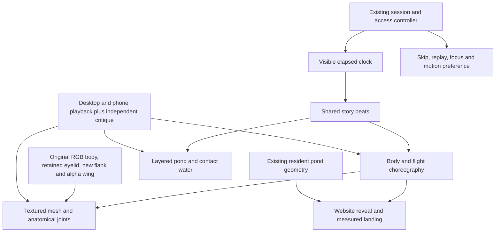

> Status — LOCAL WING FOLLOW-UP COMPLETE, September 10, 2026. Build `bbTrs4g9kljfX6-Ec1gvs` passes all 33 source scripts, types, production build and all 12 release checks. Desktop/phone unfolding frames, independent critique and Chromium/WebKit playback checks pass. The current preview is `http://localhost:3112/`. Nothing was published; release requires explicit approval.

## Context

The earlier opening used a rigid sleeping sprite, two wing copies and a flight/upright crossfade. Independent critique found a doubled head and torso during landing. The current implementation retains the existing session, keyboard, reduced-motion and loading controller while replacing that visual layer with a connected anatomical rig and one shared body engraving.

## Goals / Non-Goals

Build a graceful engraved character whose anatomy moves continuously, integrate it with water and light, and make the full sequence feel deliberately timed. Preserve site character and all prior approved functionality. Publishing and audio are outside scope.

## Decisions

### Character and artwork

`ArrivalBird` textures one anatomical mesh from `engraving-plate-v2.webp`. This is an opaque RGB plate, so `arrivalArtwork.ts` clips it to `ARRIVAL_BODY_OUTLINE` before rendering. The accepted `anatomy-detail-v2.webp` still supplies the closed eyelid. The new `anatomy-flank-v3.webp` supersedes that detail plate's flank/shoulder texture, replacing the remaining folded-wing-looking plumage with short body contour feathers. The fully awake, folded pose returns the original base texture. The reused wing has real alpha, and a native gradient softens its shoulder root. Exact sources, hashes and the retained new prompt are recorded in [artwork-provenance.md](artwork-provenance.md).

The old radial flank mask left long painted feathers at the upper-back edge, making the torso appear to retain a second closed wing beneath the animated one. The replacement reaches the full upper-back silhouette and feathers only its lower/front edges, still inside the native outline. The new plate is also opaque RGB with baked checker pixels; selective clipping excludes its background. Four character assets now total 1,536,176 bytes, 407,250 bytes more than the prior candidate. The existing pond artwork remains reused.

The third `compose` argument identifies opening unfolding only while elapsed time is below 5300 ms. In that interval, the exposed-flank material is complete by `wings=0.005`, before a moving wing is visible above that value. The returning bird retains its 0.22 material-blend threshold. This removes the second painted wing during the first reveal while preserving the accepted eyelid and exact original resting identity.

Head and neck motion deform the body continuously. The head retains its shape and a level bill as the neck extends; delayed head, neck, torso and tuft response carries the shake through the bird. The wing rig keeps full-sized shoulders attached while elbow, wrist and primary feathers unfold. Regressions check neck texture orientation, anatomical landmarks, shoulder attachment, wing breadth and the cleaned tail-to-foot opening. Canvas/SVG composition supports measured landing and immediate skipping; a fixed video would require a separate transition into the responsive resident.

### Choreography and contact

`ARRIVAL_BEATS` provides one 12.8-second timing contract, driven by the controller's visible elapsed clock. The clock pauses while the tab is hidden. Scene layers do not run separate autonomous clocks.

| Event | Elapsed time |
| --- | --- |
| Wake ends; shake begins | 2200 ms |
| First unfolding begins / reaches its raised pose | 3190 / 3560 ms |
| Shake ends; launch builds | 3250 ms |
| Near / far powered stroke begins | 3560 / 3588 ms, each with a 40 ms eased onset |
| Lift begins / body clears water | 3700 / 4100 ms |
| Feather begins becoming visible / launch ends | 5080 / 5300 ms |
| Feather quill reaches water | 7750 ms |
| Quiet interval ends; crossing and reveal begin | 8500 ms |
| Crossing ends; curved return begins | 9650 ms |
| Returning bird contacts water | 11380 ms |
| Exact resident handoff | 11600 ms |
| Opening finishes | 12800 ms |

The opening body width is `min(1.1 × viewport width, 0.94 × viewport height, 900 px)`, with its resting waterline at 63% of viewport height. The feather appears before the launch interval ends, drifts with changing orientation and slows to zero downward velocity at contact. Its quill holds the same 54%-width, 63%-height position that starts the pond ripple. The crossing and curved reveal use the same progress. The landing actor uses the resident's original body and finishes facing left, upright and clipped to the same waterline. At 11600 ms the actor disappears and the resident appears atomically; there is no two-body dissolve.

The bounded wing follow-up unfolds the opening wing from 3190 to 3560 ms before starting its powered stroke. Previously the running stroke clock could move a still-compressed wing into a spike. During the opening, the near wing's stroke time stays clamped until 3560 ms and the far wing's until 3588 ms; each eases into its phase over 40 ms. After that onset, the existing 410 ms stroke clock applies. Crossing, return and later poses retain their previous phase behavior.

### Pond, camera and access

The environment combines the retained engraved shoreline with a warm distant mist, open central water, deeper teal foreground and slowly moving reflected-light bands and edge reeds. Foreground contact waves stay at the resting waterline as the bird lifts. Ballistic drops hand off to impact rings at their own landing coordinates; wider wakes persist after departure. Feather rings begin at the quill's exact contact time and position.

Pond buffers share an effective device-pixel ratio capped by both 2× density and four million pixels per buffer. Density may fall below 1× on very large viewports. Main, cached and temporary landscape dimensions are bounded, old buffers are released, and resizing reduces height before changing width to avoid a transient oversized allocation. Character buffers are floored and capped at two million pixels each. The reflection reuses the body render, and cached alpha coverage skips transparent mesh regions without reading pixels each frame. The prior candidate's unrecorded production measurements on this Mac had no frame interval over 33.4 ms from shake through settle. Those timing measurements do not include the new flank asset/mask and were not repeated for this bounded follow-up. Current structural allocation/cache checks and desktop/phone playback pass; physical-phone performance remains unmeasured.

The wrapper measures the main resident's transformed SVG geometry, excluding its reflection. The fallback converts the cropped resident's width back to the full engraving width. No camera travel occurs when the full visible bird, water clearance and article invitation fit inside the usable viewport. On short landscape screens, the invitation sits beside the grebe at the waterline so both fit together. Normal travel occurs while the landscape is opaque, with 18 px below the actual fixed header (at least 90 px from the viewport top) and 18 px at the bottom. Late orientation changes receive a gradual correction. The oversized-content fallback remains defensive; it does not establish acceptance for a normal phone viewport.

Successful completion keeps that landing position and focuses “Find an article” with `preventScroll`; the invitation label receives the visible focus treatment. Skip or Escape restores the visitor's previous scroll and focus. Navigation interruptions leave the new route or anchor in control. Loading failure, reduced motion and session/history eligibility retain the controller's existing recovery rules. The roaming schedule remains the original two-slot schedule.

### Preparation before hydration

The root layout renders `ArrivalPreparationHead` in the head and `ArrivalPreparationBody` first in the body. A small self-contained inline script opts eligible fresh homepage visits into critical CSS before the page paints. The native cover uses the same water-gradient stops, landscape scale/placement and mist/light direction as the Canvas pond. It is hidden by default, so disabled or blocked JavaScript leaves the website readable. Seen sessions, reduced motion, hashes, history restoration and non-home routes bypass it.

Delegated native controls support Skip, Escape and contained keyboard focus before React hydrates. A four-second deadline counts visible time only and pauses in hidden tabs. Skip or expiry records the session and a document marker, including when storage is blocked, so late artwork cannot start an unsolicited film. Failure releases the cover and suppresses a late automatic start within that document without consuming an unseen session. Manual replay remains available. The existing hydrated asset/decode deadline remains 2.5 seconds.

The controller releases the native cover in a layout effect after active-film markup commits. Beginning a new preparation attempt and React StrictMode replacement do not remove it. Release restores focus only when the native button still owns focus, so it cannot steal focus from the active film's Skip. Timers, observers and native event listeners are removed on release. The helper is named `arrivalPreparationController.ts` to avoid extensionless resolution colliding with `ArrivalPreparation.tsx` on a case-insensitive filesystem.

## Risks / Trade-offs

- A detailed mesh can show seams or distort anatomy. Test shared triangle edges and landmark continuity, then inspect the rendered face and wing silhouette at full scale.
- Generated raster alpha is unreliable. Inspect every source; use deliberate native silhouette composition or reject it. Do not conceal defects with blend modes.
- The initial preparation check exposed the website before the active film. The native cover and delayed-art browser regression address that gap. Final production checks verified the opaque native cover, Skip before hydration, deadline suppression after hydration and no-JavaScript access.
- A different return illustration can break identity. Prefer one articulated body and validate the resident handoff closely; do not accept a two-image dissolve.
- Mobile pond position can require camera travel. Measure actual body and invitation bounds, move only as far as needed under the opaque scene, and verify completion separately from Skip/Escape restoration.
- Geometric correctness does not guarantee smooth playback. An earlier launch measurement found approximately 35 fps on desktop and 51 fps on phone. Focused measurements improved after reflection/mesh optimization; repeat them on the final candidate and keep stable-torso engraving motion and desktop primary-feather cropping visible in the artistic review.
- Visual quality is subjective and cannot be inferred from green tests. Keep the goal active until full playback, frames and independent critique support every explicit requirement.

## Validation and delivery

Record a baseline, then iterative desktop and phone playback with exact source references. Run meaningful rig/mesh/water regressions, existing lifecycle/integration checks, TypeScript, the local production release gate and strict OpenSpec validation. Deliver only a local candidate and recordings. Retain prior assets and snapshots; do not publish.

The focused evidence in [qa.md](qa.md) establishes particular contracts and documents revisions. It does not replace a fresh recording, independent critique and production check after source and artwork stop changing. Publishing requires separate user approval.
