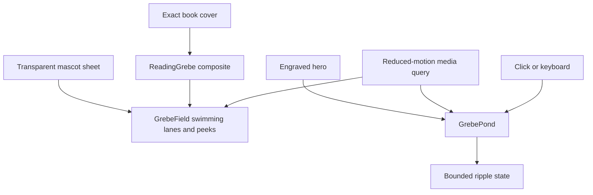
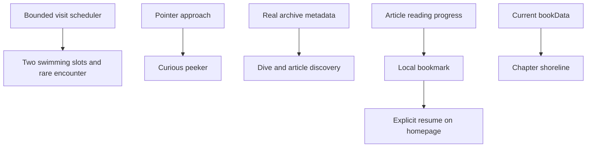
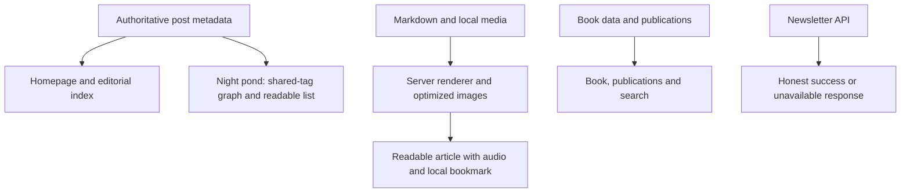
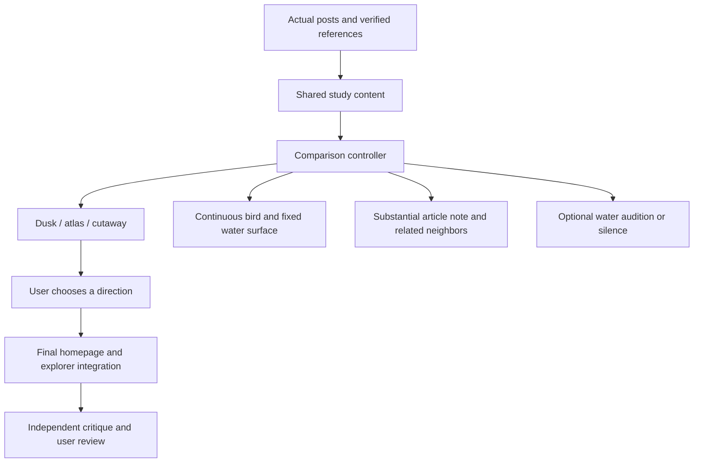
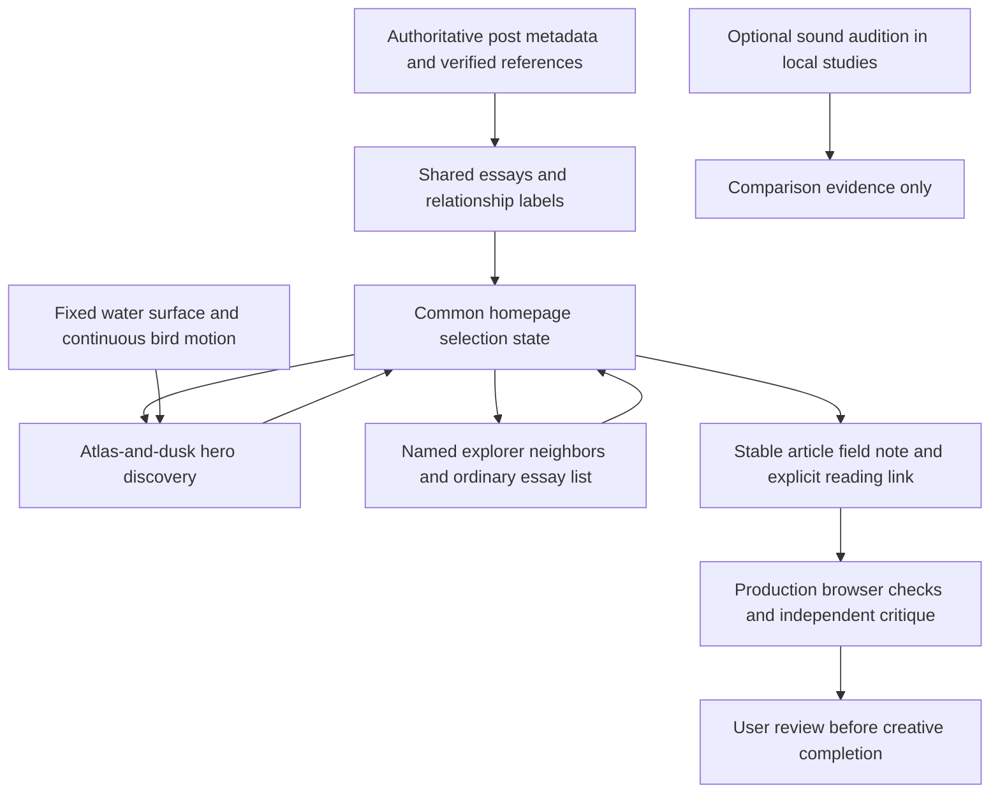
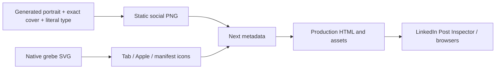

> Status: SPACING CORRECTION IN PROGRESS — the approved grebe site and the requested author/book sharing identity are live at https://econoben.dev, application source `737437e84acd71ba44b046e2c50283bf07549478`. Production metadata and every identity asset pass crawler verification. LinkedIn Post Inspector redirects to sign-in, so its external cached preview requires an authenticated refresh. The user requested a bounded card-spacing correction after the release; tasks 14.1–14.2 track that follow-up. Earlier phases below remain historical. The branch is pushed, unmerged and unarchived.

The earlier sections preserve the sequence of design decisions. The selected-treatment, latest-revision and final user-review sections below govern the current implementation, superseding historical click-positioned ripples, metaphorical interface copy, production sound experiments and pending creative-review statements.

## Context

Production baseline: 24e82a12, merged grebe launch #79. The original local checkout is an older branch with generated-file dirt and remains untouched. Work is isolated in feat/grebe-field-notes.

## Goals / Non-Goals

**Goals:** Make the grebe memorable through craftsmanship and placement; restore readable scale; make shared chrome feel native to the book-inspired palette.

**Non-goals:** New information architecture, changed article text or biography, regenerated cover, new tracking, dependencies, deployment or a CSS-system rewrite.

## Decisions

Palette: paper #f7f2e8, ink #211e1f, deep water #176b69, ripple #84b8b1, horn gold #d6a03b, release red #b9140b. Rust stays in the bird. Retain Inter for headings/navigation and Newsreader for prose; no new font requests. Left-align copy, balance headline against a reserved illustration area, keep functional navigation familiar.

```
wordmark                         existing navigation

author + subject                 engraved swimming grebe
writing-first headline           quiet ripple field
description + actions            latest article

Agent Memory + existing copy                    exact cover
current focus: three quiet columns
selected work: existing articles and book
contact links / newsletter / footer
```

Plan critique: generic cream-and-serif styling would add little; the distinguishing investment is anatomically recognizable engraving, true water ripples and controlled scale. Avoid faux specimen numbering, ornamental labels, new taglines or a wallpaper of identical birds. Preserve the approved warmth while removing the one-word headline accent and shiny navigation tab.

## Second-pass direction

Ben explicitly prefers a combination of playful, unmistakable character and slower cinematic motion. His examples highlight the reading grebe and edge peeks. The initial static-only interpretation was too restrained and is superseded.

Keep the existing paper, Inter/Newsreader and route structure. Spend visual emphasis on one immersive homepage pond: a large engraved grebe, occasional book-reading visitors in the viewport, softly expanding elliptical contours, and click/tap/keyboard ripples. The book spotlight becomes a deep teal spread for a stronger transition. All source cover pixels stay exact.

The viewport field uses the original mascot sheet, verified to have alpha, optimized to WebP. Two independent client-side slots send one swimmer from each shore, never more than two total. Arrival times, crossing durations, heights and gaps vary. The first right-side visitor reads the book; later right-side visitors have a 55% chance of reading. The reader is not permanently mounted in the hero. Hidden tabs and reduced motion stop scheduling; listeners and timers are cleaned up on unmount. A periodic edge peek remains. Central opacity is reduced behind reading content. Every bird is pointer-transparent and decorative. The reading companion receives a deterministic miniature of the actual book cover over its blank card; its cover is never mirrored.

The hero's white-background engraving is blended directly over its own painted pond surface. Background birds never use that engraving, which fixes the white matte regardless of stacking contexts or surface color.

At Ben’s explicit request, the header has no pond pause button or motion provider. Navigation uses plain, spaced text links and a fine current-page underline. The reduced-motion media query disables all ambient motion and hides the drifting field; user-created ripples become static marks. Ripple instances are capped at six and removed on animation completion.



## Risks / Trade-offs

- Moving decoration can compete with reading → use lower central opacity, keep decoration behind content, retain reduced-motion behavior.
- Blending is unreliable across stacking contexts → verified alpha for every viewport swimmer; direct painted background for hero blend only.
- A tiny book could look like a generic note → composite the exact cover deterministically with the existing sprite.
- Too much motion can look busy → two bounded slots with staggered arrivals, gaps, and a periodic peek; test live rather than judge only stills.

## Validation and migration

Run existing source contracts, TypeScript, production build and strict OpenSpec validation. Review production-server screenshots at 390, 768, 1024 and 1440 pixels, check title/actions, overflow, nav and book continuity. No persistent data changes; reverting the scoped files restores prior visuals. Keep the change unmerged for visual review.

## Approved personality pass

Use the existing paper, charcoal, deep teal and ink artwork. Preserve typography, routes and the editorial hierarchy. Concentrate surprise in direct interactions; decorative visitors stay capped at two. Initial arrivals begin at 0.2–0.7s and 2–4s, with a short animation head start to bring birds into view. Rare coordinated encounters wait for an empty pond rather than adding birds. The main grebe dives and resurfaces with an existing article recommendation; links require a separate explicit click. The peeker responds to pointer proximity and speed but never intercepts input. A locally stored, validated unfinished-reading bookmark offers explicit resume and dismissal. The shoreline enhances chapter discovery with the exact current data. No accounts, server storage, tracking, new art or dependencies.



Validation: virtual clock for density, initial timing, rare meetings and cancellation; invalid/unavailable storage and explicit-resume checks; keyboard and reduced-motion behavior; real-browser mobile/desktop screenshots; production build, types, source contracts, link crawl, strict OpenSpec validation.

## Physical dive refinement

Retain the warm paper and engraved grebe. Pointer motion gently displaces the bird away from approach using independently eased translate/rotate properties, preserving the main animation. A 3.8-second dive replaces the abrupt 1.8-second disappearance: anticipation, gradual immersion, bubbles, then a soft resurface. At depth, an elliptical teal light field with sparse gold points briefly appears and fades back into the paper. This is a single activation-triggered visual event, never another ambient wallpaper. Sound is a quiet synthesized bubble sequence, enabled only after an explicit activation, with a mute control, hidden-tab cancellation and unmount cleanup. Reduced motion bypasses choreography and reveals the article immediately. Existing two-swimmer cap and other interactions remain. Audio implementation follows MDN AudioContext and AudioParam exponential ramp guidance.

## Comprehensive review direction — 2026-09-06

The governing direction is a naturalist publication: paper #f7f2e8, charcoal #211e1f, water #176b69, night water #123b3d, gold #e0bd78. Retain Inter for navigation/headings and Newsreader for reading, with a stronger article h2/h3 scale and readable metadata. Left-align content, limit reading measures, and reduce boxed chrome. The grebe remains the identity; effects are only valuable when they support discovery.

First impression: stabilize the hero when dive results change, keep early margin visitors but attenuate them strongly behind text, and maintain a crafted engraved pond. Exploration: replace the repeated selected-work/book cards with a bounded night pond of actual essays; a selected light reveals its title, summary and real shared-topic connections, with an equally usable list. Reading: server-render markdown/highlighting, optimize original images, strengthen hierarchy, and repair audio/links. Trust: honest newsletter outcomes, safe local bookmarks, accurate book inclusion in publication search.

Alternatives considered: more ambient birds would violate density/readability; a full-screen animated world would overtake the publication and increase interaction burden. A contained content graph adds a meaningful discovery route without changing site structure. It has no continuous animation, canvas, WebGL or extra dependencies.



Acceptance is goal-wide: all major route types reviewed in-browser; representative narrow/tablet/desktop views; pointer/keyboard discovery and book selection; actual partial-read/resume flow; audio and safe newsletter behavior tested; payload improvements measured; unchanged source-content/cover integrity; independent final review; working local preview and screenshot evidence. No deployment.

## Round two: water, character, and relationships

The user finds the initial sound too light, the dive insufficiently fluid, the returned article underdeveloped, and the night graph evocative of space. Current evidence agrees: three sine sweeps supply almost all sound, the hero image includes baked ripples, a moving inset clip hides bird and water together, the paper symbol is independent of the bird, and graph positions are unrelated to topic.

The completed comparison route `/pond-studies` preserves the existing site modules and offers three distinct environmental treatments with identical real-essay content, dive timing, article card and selection controls. Desktop and phone comparisons are complete. The user has selected a combination of field atlas and dusk pond for final integration.

**Dusk pond:** paper #f7f2e8, water #173f3d, bank #63745f, reflection #aac2a1, reed #203a2c, warm light #e7c286. Visible far bank, engraved reeds and horizontal reflections establish water.
**Field atlas:** paper #f1ead8, ink #34584d, water #d6dfcd, contour #8a9e7c, gold #b98e47. Curving shores and named neighboring essays read as an annotated naturalist plate.
**Underwater cutaway:** upper light #e8e9d4, shallows #60968b, deep water #103e46, refracted light #a9d3b1, sand #bead81. A real surface and illustrated underwater space supply theatrical depth, with all related essays treated as peers.

Keep existing Inter/Newsreader; headings and control labels remain concise, prose left aligned. One composed scene plus a substantial article field note takes the emphasis. Related essays appear as named neighbors with explicit shared-tag or verified shared-publication-reference labels; no invented prerequisite or continuation. The same data drives all variants. Avoid arbitrary stars, unnamed dots or edges used as decoration.

Layout:
```
comparison navigation                 desktop / phone

[ water, bird, continuous dive ] [ article field note ]
[ selected essay → named neighbors with reasons       ]

Phone: water → field note → related essays, with clear selection feedback.
```

The original engraving remains unchanged. A close SVG silhouette clip isolates the bird; a separate fixed world-space surface clip handles immersion. Pointer response and bird choreography use nested transforms. Sound is silent initially; enabling allows the next deliberate dive to audition entry, submerged texture and return, without autoplay. Motion and audio cancel together on variant changes, reduced motion, hidden document and unmount.



Risk: the prototypes could become three superficial recolorings → give each distinct environmental geometry and relation treatment. Risk: environmental detail competes with text → keep scene art behind clearly positioned controls and article reading on a quiet surface. Risk: sound judged only by code → provide a repeatable audition and acknowledge listening limits. The visual choice is now resolved; final production craft and user acceptance remain open.

## Selected treatment: field atlas with a dusk shoreline — 2026-09-06

Use the field atlas as the editorial foundation: warm paper, fine ink contours, restrained annotations and explicit labels for neighboring ideas. Bring in the dusk treatment's natural reed-lined bank, layered water and a reflection tied to the grebe. Keep the current fonts, authoritative artwork, ordinary reading links, two-swimmer limit and edge peeker. The result should feel like one illustrated naturalist publication; the cutaway remains available as a study rather than the production direction.

The comparison uses seven actual essays and eleven evidence-backed connections. Shared-topic labels come from source tags; the directional publication-reference labels distinguish the essay mentioning a report from the essay introducing it. Original post prose and cover pixels remain untouched. Production hero discovery and the related-article section share one selected essay in their common parent, so a discovery updates the matching article and related entries together. Retain explicit read actions and native focus behavior; a later dive must not inherit a stale focus request from an earlier manual selection.

Keep the tested 3.8-second continuous choreography: a fixed world-space water clip hides the isolated bird, surfacing begins at 2.1 seconds, the article changes at 3.15 seconds when the grebe returns with the paper, and the motion settles at 3.8 seconds. The reflection receives the same pointer displacement as the bird. The paper stays attached during the return, with the article reveal supplying the connection to the bank. Hidden documents, reduced motion, replaced interactions and unmount cancel pending work; reduced motion reveals immediately. Do not swap the article at the first visible emergence.

The study phone card measured 517.765625 CSS pixels high for all seven essays, with native focus on each selected heading and no document overflow. This is evidence for the reserved-layout strategy, not a hard-coded production height requirement; the integrated layout must remain stable with its actual fonts, width and content.



The sound decision is final: the production pond remains silent, without a sound control or AudioContext. The audition has not demonstrated clear value for the site, so keep it only as an optional local comparison in `/pond-studies`. Browser evidence confirms no audio context on enabling alone, a running context during an enabled study dive, and a closed context after mute. That verifies activation and cleanup; no physical speaker/headphone test, perceived-loudness assessment or cross-device listening evaluation is claimed. Intentional article audio controls remain available. No further sound approval is pending.

Risks and remaining acceptance:

- The source began as a single engraved pose. Independent neck response and dive articulation now preserve a fixed joint and overlap while retaining the original artwork. Fresh frame review found no remaining visible continuity defect; final user review still determines whether the motion has the desired character.
- Atlas annotation and dusk scenery can compete if treated as separate layers of decoration. Compose one shoreline and quiet reading surface, then inspect the actual homepage at narrow, tablet and desktop widths.
- Shared selection can lose focus or leave the hero and explorer disagreeing. Test discovery, new and repeated manual selections, related navigation, cancellation and reduced motion against the real shared controller.
- Fresh production-frame and responsive evidence completes task 11.2; task 11.6 remains open for final user review. Completed integration, shared-state and invariant checks remain recorded separately. No deploy, publish, merge or archive at this stage.

## Latest revision: literal copy, coordinated water and silent production — 2026-09-06

The user explicitly requests no puns. Keep visual personality in the grebe, original illustration, restrained motion and chapter graphic; functional language describes the action directly. The hero now reads “Find an article,” uses “Finding an article…” / “Retrieving an article…” / “Article selected” during the sequence, labels its note “Suggested article,” and offers “Read article” and “Related articles.” Preserve article titles, summaries and book content rather than rewriting authoritative prose to match interface copy.

“Related articles” is a plain selected-article and related-entry layout. Each entry explains why it is related and separates “Read article” from “View related articles.” Previous selections are shown literally, without the earlier graphical channel map or a metaphorical reading-path label. Manual selection continues to update the common state and move focus to the selected heading; the ordinary article list remains usable directly.

Rename the chapter section to “Explore the chapters” and give it the instruction “Select a chapter to see its summary and availability.” Preserve the actual curved-water chapter graphic, all ten chapter stops, keyboard/touch selection, authoritative chapter descriptions, Chapters 1–3 available / Chapter 4 next, tracked O’Reilly actions and the full contents. This is a language refinement, not removal of the chapter visualization.

The selected dive establishes one physical waterline for the bird, reflection and wake. An accepted activation coordinates one dive, wake, splash and bounded bubble trail; repeated activation cannot accumulate another sequence. This supersedes the initial click-positioned ripple behavior and six-ripple pool described in the earlier design history. Pointer movement remains a separate, restrained bird/neck response. Reduced motion suppresses choreography while preserving selection.

The reduced-motion announcement defect is fixed: clearing and setting identical status text in one event previously left the live region unchanged on later discoveries. The controller now records an announcement request and reads the actual shared selection after rendering. Repeated activations and two activations in one batch announce the final selected title, without moving focus or adding a delayed timer. A MutationObserver regression failed before the fix and passes afterward.

The production silence decision closes tasks 10.8 and 11.3. Fresh motion evidence now closes 11.2 as recorded below. Task 11.6 remains open for final user review; technical and independent visual checks do not substitute for that review.

## Refined motion verified; final user review pending — 2026-09-06

The grebe now combines a fixed body/neck joint, separately eased neck curiosity and neck-led anticipation within the continuous dive. The source-space neck hinge remains at (535, 480); measured screen coordinates before and after the independent neck transform agree to floating-point precision. The paper is drawn behind the bill so the grip stays attached on the return. The short contact line at the resting waterline fades during immersion and early resurfacing instead of crossing the moving bird as a hard horizontal mark. Bird and reflection remain subject to the fixed water clip.

The eight captured states at 300, 700, 1050, 1650, 2250, 2750, 3250 and 3900ms establish the visible sequence. Contact opacity is zero at 1650 and 2250ms. The existing article remains until the reveal, the new title is present at 3250ms, and the control is idle by 3900ms. The note stays exactly 372.03125px high in every sampled frame. Controller tests provide the exact 2.1/3.15/3.8-second phase boundaries; frame samples show the rendered result rather than claiming frame-perfect timing.

Independent editorial review confirms neck continuity, paper grip, the corrected contact line, stable card and clearer related-article layout. The root's real-browser checks cover 320, 390, 820 and 1440px without horizontal page overflow, mobile shared selection, normal reading links, repeated-selection focus and distinct repeated reduced-motion announcements with no animation or pond audio. The preserved chapter graphic shows Chapters 1–3 live and Chapter 4 next under “Explore the chapters.”

The study footer now describes the existing combined homepage and the settled production-silence decision. Subscription copy is literal “Email updates” with a description of writing, talks and chapter releases; its behavior and source content remain unchanged. The latest motion and responsive evidence is indexed in `validation.md` under `pond-round-two/atlas-dusk/refinement/`. Final user creative review is the remaining acceptance step; nothing is deployed or archived.

## Final user review: a swimmer already in motion — 2026-09-06

The user accepted the refinement with a bounded startup correction: a grebe should already be floating across the screen on arrival, without changing the pacing or number of birds. This resolves the earlier pending creative review. No additional aesthetic approval is required after that correction is validated.

`startPondVisits` now publishes the first left swimmer synchronously when the visible, full-motion client scheduler mounts. Its animation begins one quarter of the way through the existing crossing, using a negative delay of `duration / 4`; the initial departure timer accounts for that elapsed portion. The 34–49-second full crossing duration and CSS motion path are unchanged, so its velocity is unchanged. The right swimmer still arrives after 2–4 seconds. Ordinary 9–23-second gaps, occasional reading visitors, coordinated meetings and the cap of two swimmers remain unchanged. This starts immediately after hydration; no server-rendered swimmer or pre-hydration guarantee is claimed.

Immediate publication exposed a lifecycle edge case: a hidden/visible or reduced-motion toggle batched into one React update could reuse visit ID zero and retain the old CSS animation clock. Each scheduler session now contributes a monotonically increasing key alongside the visit ID. A restart therefore mounts a fresh animation node while preserving its timing, size, position and delay. Hidden pages, reduced motion and unmount still clear arrivals and departures; Strict Mode leaves one active scheduler.

The source scheduler regression failed before the startup fix, and the actual-component DOM identity regression failed before the session-key fix. Both now pass, alongside peeker and TypeScript checks. Browser evidence shows an already-running first swimmer on desktop and phone, movement across a 350ms interval, zero swimmers with reduced motion and one after re-enabling it. Initial placement is inside 320, 390, 820 and 1440px viewports. The final production build and smoke check pass, including a fresh animation node after a motion-preference restart and no browser errors. The local change remains unmerged and unarchived.

## Sharing and browser identity — September 6, 2026

Use a static 1200 × 630 PNG with large author identity, exact O’Reilly book cover, warm paper and a newly generated adult grebe portrait. Compose authoritative text and book pixels deterministically. Use a separate simplified SVG grebe for tab-scale recognition, with PNG/apple/installable icons and a maskable variant. Version filenames to avoid reusing cached old artwork. Default metadata names Ben and Agent Memory; route-specific titles and custom images remain authoritative.



Validation includes source and real-rendered metadata, exact image sizes, icon small-size inspection, route-specific metadata preservation, production build, HTTP content types and a LinkedIn crawler user agent. LinkedIn owns preview caching: run its Post Inspector after release when accessible; document any sign-in limitation. LinkedIn says refreshed information applies to new posts, not existing shared posts. Preserve the recorded prior deployment for rollback.

## Social card spacing correction — September 6, 2026

The user identified an awkward visual collision between the large grebe bill and the feet printed on the book. Move only the existing portrait left by 100px in the editable composition. Preserve exact cover and portrait artwork, typography, icon family and every other placement. Export a version 2 image and update metadata atomically so cached version 1 remains intact. Verify the complete composition at normal and reduced sharing size before release.
