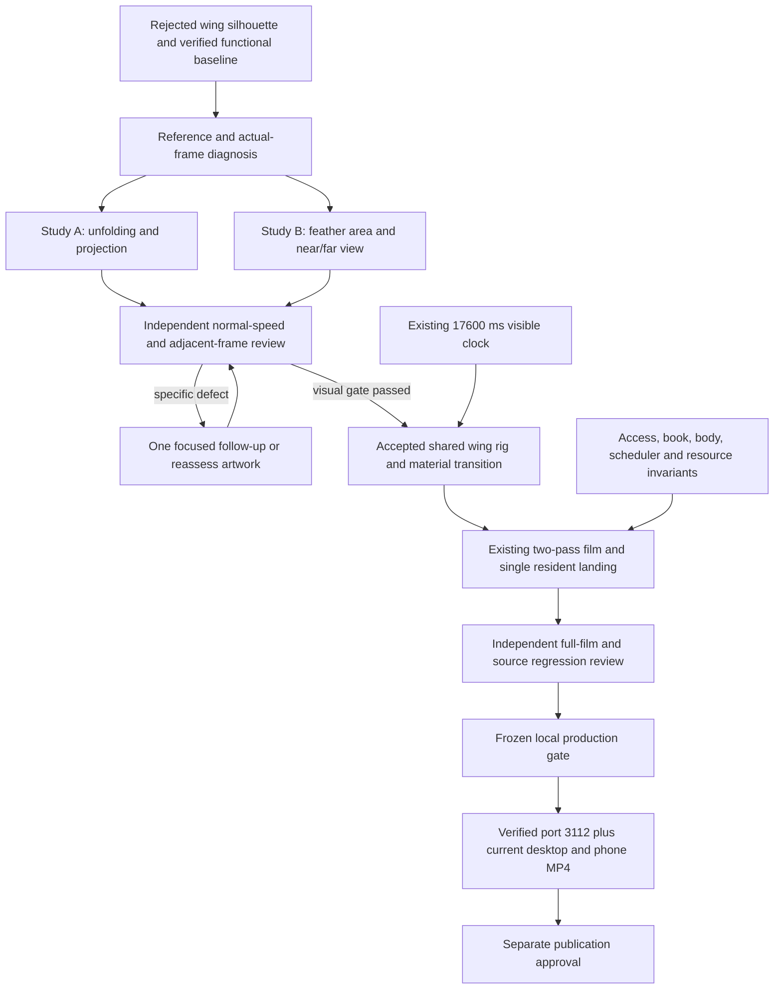

> Status — LOCAL IMPLEMENTATION AND VERIFICATION COMPLETE, September 10, 2026. The selected sectioned wings passed independent isolated and integrated review, the 43-suite production gate, final Chromium/WebKit desktop and phone playback, scoped lifecycle checks and current performance measurement. Verified preview and fresh MP4s are ready for local delivery. Publication remains unauthorized; archive is deferred until the approved release workflow is complete.

## Context

The baseline is build `QsI2QzDIQ1r87XsztmOSc`, retained snapshot `/var/folders/17/b7kp7zcd0xbc4vr9sm2w848h0000gn/T/econoben-release-1Wilcd/source`, source manifest `bb9cb299a1fa46e8aa5c98eb28900b8de26985dba6b75bc32c5b7208eb4d1be7`. Its release gate, lifecycle and final native evidence remain useful regression references. Its previous independent visual PASS no longer establishes satisfaction with wing silhouette; Ben's later feedback supersedes that judgment.

`AnatomicalBird` is shared by the isolated `/pond-studies/flight` study and the opening through the `ArrivalBird` compatibility export. The renderer uses paired dorsal/ventral feather textures, articulated shoulder/elbow/wrist geometry, cached coverage, one prepared actor and a copied reflection. Body movement preserves the existing moderate neck lean and subtle stroke response. The settled Canvas body and resident SVG use the same original engraving.

The retained `wing-proportions/README.md` describes the unresolved complaint. Increasing every bone by 25% and chord from .56 to .72 enlarged area but left narrow upright emergence, and an existing continuity check rejected its displacement. The experiment is preserved and restored out of application source. Do not claim that it passed or weaken a test merely to accept it.

Source inspection identifies several interacting hypotheses. The hero applies an eased 3100–3750 ms deployment channel, and `flightWingFrame` applies additional eased joint thresholds. This can delay visible unfolding. The initial .56 chord scale, three-quarter projection and far-wing/head overlap affect perceived area. The closed-wing material disappears by deployment .005 and moving meshes start above .005; this prevents a duplicate but can leave only a thin projected sliver at the first visible opening. These are diagnoses to test on real textured frames, not conclusions that any one constant is wrong.

## Goals / Non-Goals

**Goals**

- Make the wings look substantial, connected and recognizably grebe-like from early emergence through recovery, using full-length articulated segments and a readable feather fan.
- Establish the correction through a small number of distinct studies with independent desktop/phone normal-speed and adjacent-frame critique, then verify it at all three visible flight scales and landing.
- Preserve the complete film, accessible interruption paths, resource ownership and restrained site identity; deliver exact-source local preview and fresh full-opening MP4s.

**Non-goals**

Retiming the whole film, redesigning the body/pond/book, adding motion elsewhere, new puns/copy, extra birds, audio, dependency maintenance or publishing. The study remains a local development surface without public navigation or production access. Reference photography informs anatomy and is not downloaded into site artwork for reuse.

## Decisions

### Selected sectioned wing and final acceptance

The initial fuller/articulated geometry studies failed independent review, and the first sectioned candidate then failed on a recovery needle and translucent triangle facets. The accepted isolated candidate retains the v3 feather artwork as overlapping proximal, secondary and primary sections with five prepared material blends. Its rig uses the fuller 960-unit total span, .9 chord, curved feather-joint transitions and a modest surface curvature to retain volume during recovery. The current recovery offsets are `[20,-15,65]`, camber 65 and joint radius 110; these are implementation choices, not measured bird anatomy.

The renderer composes a partially visible wing at full opacity into a temporary reusable layer and applies its opacity once. This removes cumulative dark seams from overlapping triangles. Full-opacity flight draws directly to the existing actor, and the temporary backing store is released between opacity transitions. The final source gate verifies that ownership, and current native interruption checks observed the owned buffers released to 1×1. `resource-inventory.md` records allocation bounds; fresh production measurements retain the startup limitation below.

`release-artifacts/2026-09-10-wing-refinement/sectioned-study-review-v2.md` records the independent PASS, exact hashes, native desktop/phone comparisons and adjacent captures. The brief initial crossfade and stylized foreshortened fold remain explicit artistic limits. The old `integration-clearance.md` uses the rejected articulated geometry as a proxy; its sizing options are not acceptance evidence for the selected wing. Actual sectioned full-film review subsequently passed in five viewports, with final production checks recorded in the QA inventory.

### Integrated framing and current verification boundary

After isolated acceptance, the default rig/art registry and hero deployment were switched to the sectioned candidate. The hero uses a .77 viewport-height cap. Crossing size derives from the measured feather envelope and the space above the book instead of reserving only .2 of actor size below the anchor. Short landscape uses a 162 px book-height reservation with compact typography and a bottom-right 44 px Skip control. Its visible label is Skip and its accessible name remains Skip opening.

Wing closure now uses one 720–160 ms-before-contact interval in every orientation. The viewport-dependent earlier fold briefly reopened the wings during late rotation, so this shared timeline preserves continuity while still clearing the short landscape bottom edge. Native development review passed the full film in five viewports; the final folded glide is explicit in that review.

After the frozen review, the compact card width changed from viewport-minus 176 to viewport-minus 192 to separate its border from the focused Skip outline at 568 px. The final 568×320 production check measured the 376 px card and 11.703px gap to Skip; the full publication and focused control remain separate. During late landing the Skip control can cover part of the inactive invitation, which becomes fully clear when the opening ends. Final production and performance evidence was gathered separately against the frozen build.

### Initial bounded hypotheses and reassessment policy

Use the current baseline alongside two initial candidates at equivalent camera/body scale and elapsed landmarks. Candidate A addresses unfolding/projection with a single understandable joint-opening progression, backward sweep and visibly full feather presentation early. Candidate B materially changes feather fan/chord distribution and near/far presentation while retaining the shoulder and full-length bones. These are hypotheses, not fixed final parameter sets. Their difference must be visible and explainable; a series of tiny span increments is not a useful comparison.

After independent critique, allow one follow-up that combines the stronger findings or corrects a specific blocker. If neither approach works, stop parameter churn and reassess the source silhouette, material coverage or artwork. New local generated art is justified only by a diagnosed limitation of the current plate, with originals/prompt/provenance retained. No image generation is required by this planning task.

Keep the study controls isolated. Compare the first appearance of moving feathers, the interval before lift, the first power stroke and two complete recovery cycles, including near/far overlap and head clearance. Capture a normal-speed unrecorded watch before recording, then native adjacent frames and a few labeled exact/staged views. Distinguish requested from actual browser timestamps. Desktop 1440×900 and phone 390×844 are mandatory; full integration later checks 320×568 and 844×390 bounds.

### Change folding, projection and material as one anatomical transition

Preserve physical segment lengths through deployment. Rotate and fold the shoulder/elbow/wrist in depth, vary feather articulation and projection, and carry coverts naturally over the shoulder. Avoid scaling a whole miniature wing into existence or enlarging the body's coordinate system. Near/far perspective must show distinct surfaces without a second wing apparently sprouting behind the head.

Coordinate any closed-wing material change with actual visible moving feather coverage. There must be no readable second closed wing and no interval where the body appears wingless because the new surface remains edge-on. A retained full-size folded form, feathered root overlap or a revised native mask are alternatives to test. Do not solve duplication with an earlier abrupt fade that exposes the existing sliver problem. Keep the final landing material and exact resting identity intact.

Readability and connection take precedence over a numeric reference ratio. Authentic sources support silhouette and posture; they do not reveal exact hidden joints or mandate the screen projection. Use normalized geometry tests for changed continuity/proportion contracts only when they catch a real defect, with occupied-triangle validity and shoulder attachment where relevant. The independent critic judges whether the bird looks natural; a green threshold cannot close the gate.

### Preserve one clock and existing ownership

The accepted wing evaluator and any directly necessary deployment/material adjustment enter the shared renderer. No new timers, independent animation loops, hidden duplicate actors, per-frame pixel reads or second reflection render are introduced. Keep static material/coverage preparation cached, existing Canvas caps and failure disposal. If more asset views are required, include them in the exact readiness registry and bounded fallback.

The following remain invariant unless a concrete wing-integration failure requires a documented small correction.

| Area | Retained contract |
| --- | --- |
| Film | 17600 ms total; wake/shake/departure, feather/contact/ripple; first pass 8500–9700, stable book 10000–13300, second pass 13300–14600, water contact 16400, handoff 16650 |
| Book | Actual Agent Memory cover, canonical author/publisher/update; same presentation instance; no transient controls; separated from beak/feet/wing tips |
| Body and rest | Connected moderate neck, recognizable level bill, consistent torso/feet, same resident engraving and single handoff |
| Access | Native preparation, 2.5 s asset bound/visible native deadline, Skip/Escape/replay/reduced motion/session/history/hash, focus/scroll and stale-load cleanup |
| Ordinary pond | Existing two visitor slots, immediate swimmer, opposite-side cadence, peeker and resident pointer/dive/article behavior |
| Appearance | Warm paper/teal environment, silence, no extra slogans or clutter |

## Risks / Trade-offs

- **Larger wings obscure the head, book, Skip or viewport** → Inspect full silhouettes at hero/crossing/landing scales on desktop, 390/320 px and short landscape; correct projection/feather distribution before moving unrelated composition.
- **Earlier unfolding becomes a snap** → Review adjacent first-visible frames and stroke onset; preserve smooth position/velocity and full-length folding instead of threshold jumps.
- **Removing old paint creates a wingless interval** → Review actual textured coverage through the whole transition, not only an absence-of-duplicate pixel test.
- **One angle works while recovery stays narrow or mechanical** → Require two consecutive cycles and distinct near/far views in normal motion; retain failed evidence.
- **A test was calibrated to the previous small wing** → First distinguish a real discontinuity from displacement caused by legitimate dimensions. Replace only with a meaningful scale-aware contract, documenting red/green behavior and visual evidence; never relax it solely to get green.
- **Additional feather work harms startup or frame cost** → Preserve cached ownership and compare fresh unrecorded measurements with baseline 128/126 ms startup tasks and known Canvas caps. Record residual limits without a zero-stutter or physical-phone claim.

## Migration Plan

1. Preserve the existing 3112 process, snapshot and baseline MP4s while studies run on a separate local development surface. Preserve all dirty work and earlier failed comparisons.
2. Record and pass the independent isolated gate before integrating the candidate into the full scene. Run focused failing-first contracts, then the integrated artistic and lifecycle checks.
3. Coordinate final source/art freeze. Run the complete Node 22 local `release:prepare` workflow, retaining source manifest, logs, rollback metadata and exact served identity. No publishing operation is part of that workflow.
4. Replace only the owned 3112 process with the verified snapshot; verify its manifest. Capture current native Chromium/WebKit desktop/phone/landscape and interruption evidence. Retain known native-hidden-tab and physical-device limits unless newly established.
5. Record complete normal-speed desktop/phone openings from the verified candidate; encode fresh H.264/yuv420p MP4 with faststart. Verify duration, beginning/end, dimensions, decode/playback and provenance. Deliver locally with evidence and limitations; preserve the previous files as baseline.

## Final verification and limits

The isolated visual gate selected broader sectioned art after the initial geometry candidates failed. Native integrated review accepted the same full-size shoulder/fan through both crossings and the universal closing glide. Source regressions protect fixed-length articulation, the actual material transition, opaque completed-wing compositing, cropped coverage and cleanup; they support rather than replace that judgment.

Final local build `S-f02umZXzcU71qc9NRDg` passed all 43 source suites, types, installation/build and served checks. Its snapshot `econoben-release-pGdpjA/source` and manifest `49d6cece35ac4ac9bcd11cf9f24e7b1131e5117cb39d074a87a5cc7653064f71` identify the reviewed source. Four final Chromium/WebKit desktop/phone normal plays, scoped native lifecycle/rotation/pond/navigation checks, and complete shareable MP4 exports passed. The final QA inventory names source-only coverage and links exact records. Documentation/evidence changes after this snapshot are expected; no app/test/art change followed it.

Resource changes are bounded but not free. The selected wing adds 47,284 encoded bytes. Six opening URLs total 2,725,528 bytes; cropped prepared material totals32,782,912 estimated RGBA bytes, excluding browser/GPU copies. Static coverage is cached, reflection copies the main frame, and the temporary partial-opacity layer releases its backing store at full opacity and cleanup. These are source estimates and individual allocation bounds, not measured process memory.

Serial unrecorded Chromium runs on the Mac recorded powered-flight p95 scheduling intervals17.5ms desktop and 16.8ms phone viewport, and no intervals above 25ms after initial rest. Startup long tasks remained145ms and 141ms, compared with historical 128/126ms observations. The runs do not prove GPU-presented frame rate, physical-phone performance or Safari-application behavior. Recorded25fps video is visual evidence only.

The initial roughly 66ms crossfade and stylized foreshortened inner fold remain artistic limits. In very short landscape, Skip can cover part of the still-inert pond invitation until the opening ends. Native hidden-tab pause and interruption during the exact short partial-alpha interval were not established; meaningful source fixtures cover those contracts. No blocking issue remains in the scoped local review.

## Release boundary

The verified 3112 preview and desktop/phone MP4s are available locally. All owned review browsers and the spare study server are closed. Publication, push and merge remain unauthorized. Archive is deferred until the approved release workflow is complete; no further design decision is required for this local delivery.
